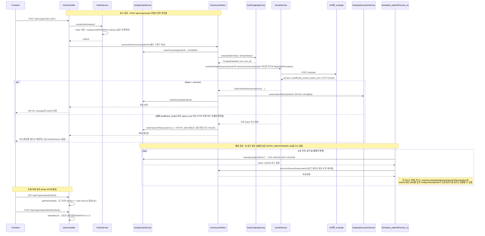

# Backend 구현 흐름 문서 (malgeum GEO 백엔드)

## 1. 문서 목적과 읽는 방법

이 문서는 `C:\Users\user\Documents\GitHub\backend`(패키지 `com.malgeum.geo`) 저장소를 처음 보는 agent/개발자가
"지금 코드가 실제로 어떻게 동작하는가"와 "여기까지 어떤 순서로 발전했는가"를 빠르게 구분해서 파악하도록 만든 단일 기준 문서입니다.

- 이 저장소는 싱가포르 식당 추천 서비스가 아니라, **웹페이지 URL을 입력받아 크롤링하고 외부 AI 서버(`/evaluate`)로 GEO(생성형 검색 최적화) 점수를 평가해주는 B2B SaaS 백엔드**입니다. (혹시 다른 프로젝트의 `CLAUDE.md`를 먼저 봤다면 그 내용은 이 저장소와 무관합니다. 이 저장소에는 별도의 `CLAUDE.md`가 없습니다.)
- 문서 전체에서 **"현재 런타임 흐름"**(지금 코드가 하는 일)과 **"구현 발전 흐름"**(Git 이력)을 의도적으로 분리했습니다. Git 커밋 순서 자체를 현재 설계로 오해하지 마세요.
- 모든 주요 주장에는 아래 3절의 상태 라벨을 붙였습니다. 라벨이 `CODE_CONFIRMED`나 `TEST_VERIFIED`가 아니면 "확인된 사실"이 아니라 "정황/계획/미확인"입니다.
- 코드 인용은 상대 경로와 `클래스::메서드`로, 역사 인용은 commit hash로 근거를 답니다. 줄 번호는 바뀌기 쉬우므로 보조 정보로만 사용합니다.
- 이 문서 자체는 신규 코드 구현이 아니라 조사 결과물입니다. 여기 적힌 MISMATCH/REMAINING 항목은 이번 작업에서 고치지 않았습니다.

## 2. Last verified snapshot

| 항목 | 값 |
|---|---|
| 검증 날짜 | 2026-08-27 |
| branch | `develop` (원격 `origin/develop`과 동일 커밋) |
| HEAD commit | `485dd9f` ("feat)add Exception Handling of AI-server") |
| working tree 상태 | dirty (아래 참고) |
| 확인한 범위 | `build.gradle.kts`, `docker-compose.yml`, `src/main/resources/application.yaml`, `src/main/java` 전체, `src/test/java` 전체, `src/test/resources`, `docs/`, `develop`에 도달 가능한 전체 git 이력, `C:\Users\user\Documents\GitHub\ai-server\geo_gateway.py`(대조용) |
| 실행하지 못한 검증 | 실제 Postgres/네트워크/AI 서버가 필요한 테스트 전체 (14절 참고), ai-server 자체의 전체 회귀 테스트 |

작업 시작 시점의 dirty 상태(`git status --short`):

```
 D AI_SERVER_INPUT_CONTRACT_IMPLEMENTATION_PLAN.md
 D Front-Back_Link_Guide.md
 D "Swagger AI 서버 테스트 방법.md"
 M src/main/resources/application.yaml
?? docs/
```

- 위 3개 `.md`는 **삭제된 것이 아니라 저장소 루트에서 `docs/`로 이동 중인 사용자 작업**입니다(`docs/` 아래 동일 파일이 존재함). 이번 작업에서 그대로 두었습니다.
- `src/main/resources/application.yaml`은 커밋된 버전(`git show HEAD:...`)에는 `spring.application.name: saas` 한 줄만 있으나, 현재 작업 트리에는 실제 DB 접속정보·OAuth client-secret·JWT 서명키가 하드코딩되어 있습니다(값은 이 문서에 옮기지 않았습니다. 12절·13절 참고). 이 파일 이력은 `d019524` 커밋 한 번뿐이므로 **이 시크릿들은 git 이력에는 없고 로컬 작업 트리에만 있는 값**입니다 — `GIT_EVIDENCE`.
- `docs/`는 이번 세션에서 추가된 미추적 디렉터리이며, 이번 작업이 만든 `BACKEND_IMPLEMENTATION_FLOW.md`도 여기 위치합니다.

## 3. 상태 라벨 범례

| 라벨 | 의미 |
|---|---|
| `CODE_CONFIRMED` | 현재 코드와 실제 호출 경로로 확인됨 |
| `TEST_VERIFIED` | 이번 세션에서 실행한 검증(컴파일/테스트)이 통과함(또는 실행되어 실패가 재현됨) |
| `GIT_EVIDENCE` | commit diff로 확인한 역사적 변화 |
| `DESIGN_TARGET` | 설계/계획 문서에는 있지만 현재 구현은 확인되지 않음 |
| `EXTERNAL_CONTEXT` | 외부 소개문 또는 사업계획서 등에 담긴 제품 의도(이번 조사에서는 사용하지 않음, 5절 참고) |
| `MISMATCH` | 코드·테스트·문서가 서로 충돌함 |
| `UNKNOWN` | 근거가 부족해 확인할 수 없음 |
| `EXTERNAL_UNVERIFIED` | 실제 DB, 실사이트, AI 서버 등 외부 환경이 필요해 이번 세션에서 검증하지 못함 |

테스트 파일이 존재하거나 컴파일된다는 사실만으로 기능이 동작한다고 서술하지 않았습니다.

## 4. 1분 프로젝트 요약

- **이 backend의 책임**: 고객사(Client)가 자사 웹페이지 URL을 제출하면(Order), 서버가 그 페이지를 크롤링하고 외부 AI 서버의 `/evaluate`에 보내 GEO 품질 점수를 받아 저장(AnalysisReport)하고 조회 API로 돌려준다. `CODE_CONFIRMED`
- **핵심 요청 흐름**: `POST /api/v1/geo/order` → `Order` 저장 → `AnalysisJob`(PENDING) 생성 → **같은 HTTP 요청 안에서 동기적으로** 크롤링 → AI 호출 → 결과 저장까지 끝내고 응답한다. 별도로 1초 간격 스케줄러가 대기열을 폴링하지만, 정상 경로에서는 동기 처리가 이미 끝내버리므로 스케줄러는 주로 실패 후 재시도 대상만 다시 집는다. `CODE_CONFIRMED` (6절)
- **외부 시스템**: (1) 사용자가 지정한 임의의 대상 웹사이트(Jsoup/Playwright로 크롤링), (2) 별도 저장소인 AI 서버(`ai-server`, FastAPI, `POST /evaluate`), (3) PostgreSQL(운영 설정 기준). `CODE_CONFIRMED`
- **핵심 aggregate**: `Client`(고객사 계정) · `Order`(분석 신청) · `AnalysisJob`(실행/재시도 상태) · `AnalysisReport`(결과물, 1 Order = 1 Report). `CODE_CONFIRMED` (7절)
- **현재 동기/비동기 처리 방식**: 이름은 "AsyncWorker"이지만 주문 API 경로는 동기다. 진짜 비동기 실행은 `@Scheduled` 폴링 스케줄러뿐이다. `CODE_CONFIRMED` — 클래스 이름만 보고 비동기라고 판단하면 안 된다.
- **가장 중요한 미확정 사항**: (1) 스케줄러 경로가 `markSucceeded`/`markFailureOrRetry`에 `orderId` 대신 `jobId`를 넘기는 버그가 있어 `AnalysisJob`과 `Order`의 PK가 어긋나면 오작동한다, (2) 동기 처리와 스케줄러가 같은 Job을 동시에 집을 수 있는 경합 창이 있다, (3) 리포트 삭제 API에 소유권 검증이 없다, (4) SSRF 방어가 없다. 전부 `CODE_CONFIRMED` (13절에 상세)

## 5. 시스템 경계와 backend 책임

| 구성요소 | 실제 사용 여부 | 근거 |
|---|---|---|
| Spring Boot 3.5 / Java 21 / Gradle(Kotlin DSL) | 사용 | `build.gradle.kts` `CODE_CONFIRMED` |
| PostgreSQL(운영 datasource) | 사용(설정 소비 코드 존재: `spring.jpa.database-platform=...PostgreSQLDialect`, `runtimeOnly("org.postgresql:postgresql")`) | `CODE_CONFIRMED` |
| H2 | 테스트 전용 임베디드 DB로만 사용(`@DataJpaTest` 기본 동작), 운영 설정에는 없음 | `CODE_CONFIRMED`(14절) |
| Redis / Kafka / OpenSearch | **`docker-compose.yml`에만 존재, `src/` 전체에서 import/참조 0건** | `CODE_CONFIRMED` — 컴포즈에 서비스가 있다고 구현됐다고 볼 수 없다는 원칙의 실제 사례 |
| `docker-compose.yml` 자체 | 파일 내용이 중복/깨져 있음(예: `redis` 서비스 블록이 두 번, `# - ./init.s` 뒤에 잘린 줄이 다음 섹션 중간에 다시 등장) — 그대로는 `docker compose up`이 의도한 대로 동작하지 않을 가능성이 높다 | `CODE_CONFIRMED`(파일 원문 확인) |
| Jsoup / Playwright(Chromium) / Flexmark(HTML→Markdown) | 사용, `GeoScrapingService`가 직접 호출 | `CODE_CONFIRMED` |
| Spring Security + JWT(`jjwt`) | 사용, `SecurityConfig`/`JwtAuthenticationFilter`/`JwtTokenProvider` | `CODE_CONFIRMED` |
| Google OAuth2 로그인(`spring-boot-starter-oauth2-client`) | 사용, `CustomOAuth2UserService`/`OAuth2LoginSuccessHandler` | `CODE_CONFIRMED` |
| Jackson/`jakarta.json`+`yasson` | Jackson만 실제 사용(엔티티 JSONB 매핑, DTO 직렬화). `jakarta.json-api`/`yasson`은 의존성만 있고 `import jakarta.json`/`import org.eclipse.yasson` 검색 결과 0건 | `CODE_CONFIRMED` — 미사용 의존성 |

책임 경계(`CODE_CONFIRMED`, 2절 아키텍처 대응):

- **Frontend**(별도 저장소, GitHub Pages `virtual-company-mal-geum.github.io`): 이 저장소 밖. `SecurityConfig`의 CORS 허용 origin 목록과 `app.frontend-base-url`(OAuth 리다이렉트 대상)만 이 저장소에 남아 있다.
- **Spring backend**(이 저장소): 인증, 주문 접수, 크롤링, AI 호출 오케스트레이션, 결과 저장/조회.
- **대상 웹사이트**: 사용자가 지정한 임의 URL. 서버가 직접 HTTP 요청을 보낸다(`GeoScrapingService`) — SSRF 방어 없음(13절).
- **AI 서버**(별도 저장소 `C:\Users\user\Documents\GitHub\ai-server`, FastAPI): `/evaluate` 엔드포인트만 이 백엔드가 호출한다. 이 저장소는 AI 서버의 내부 모델/추론 로직을 소유하지 않는다.
- **DB**: PostgreSQL, JPA `ddl-auto: update`로 스키마 자동 반영(운영 위험, 13절).

## 6. 현재 end-to-end 요청 처리 흐름

핵심 파일: `GeoController`, `OrderService`, `AnalysisJobService`, `GeoAsyncWorker`, `GeoScrapingService`, `GeoAiService`, `AnalysisExecutionService`, `AnalysisReportService`.

### 6.1 순차 흐름 요약 (`CODE_CONFIRMED`)

1. `POST /api/v1/geo/order` (`GeoController::startAnalysis`)
2. `OrderService::acceptOrder` — `SecurityContextHolder`의 인증 주체(JWT subject = clientId)로 `Client` 조회 → `Order` 저장(`resolvedDomainStatus()`로 `serviceType` 문자열을 `DomainStatus` enum으로 변환) → 같은 트랜잭션에서 `AnalysisJobService::enqueue`로 `AnalysisJob`(status=`PENDING`) 생성.
3. **`GeoController`가 트랜잭션이 끝난 orderId를 받은 즉시, 같은 HTTP 요청 스레드에서 `GeoAsyncWorker::processSynchronously(orderId)`를 직접 호출한다.** 이름과 달리 여기서 스케줄링이나 별도 스레드로 넘기는 코드는 없다 — `CODE_CONFIRMED`, 클래스명(`AsyncWorker`)만으로 비동기라고 판단하면 안 된다는 원칙이 그대로 적용되는 지점.
4. `processSynchronously`: `AnalysisJobService::markProcessing(orderId)`(→ `findByOrderId`로 찾아 `RUNNING`) → `processClaimedOrder(orderId)` → 성공 시 `markSucceeded(orderId)`, 예외 시 `markFailureOrRetry(orderId, e)` 후 예외를 그대로 다시 던진다(→ 컨트롤러까지 전파되어 500 응답).
5. `processClaimedOrder` → `buildReportContext`: `OrderService::getOrder` → `GeoScrapingService::extractDataForAi(url, domainStatus)`(Jsoup 우선, 부족하면 Playwright 폴백) → `GeoEvaluationRequest::from(scrapedData)`(여기서 `domain`이 `news/ecommerce/education` 3개가 아니면 `IllegalStateException`) → `GeoAiService::evaluateTarget` → 응답 `status`에 따라 분기.
6. 성공(`status=success`): `aiResponse.result()`를 `aiLogMap`에 담아 `AnalysisExecutionService::saveAnalysisReport`가 `AnalysisReport`(JSONB `rawScrapedData`, `rawAILog`)를 저장.
7. 실패(`insufficient_content`/`parse_error`/그 외): `IllegalStateException`을 던져 4단계의 catch로 흘러가 `markFailureOrRetry`가 재시도 대기(`RETRY_WAIT`, 최대 3회) 또는 최종 실패(`FAILED`)로 표시. **이 경로에서는 `AnalysisReport`가 아예 생성되지 않는다** — `CODE_CONFIRMED`.
8. 컨트롤러는 (예외 없이 여기까지 왔다면) `200 OK`와 `"GEO 분석이 완료되었습니다."`를 즉시 반환한다. 즉, 이 API 응답 자체가 크롤링+AI 추론 전체 시간(수 초~최대 200초, `AiRestClientConfig`의 read timeout)을 그대로 물고 있는 동기 API다.

### 6.2 스케줄러(대기열) 경로 (`CODE_CONFIRMED`)

- `GeoAsyncWorker::pollAndProcess`가 `@Scheduled(fixedDelayString = "${analysis.job.poll-delay-ms:1000}")`로 1초마다(설정 없으면 기본값) 실행되며, `AnalysisJobService::claimNextJob`이 빌 때까지 반복 처리한다.
- `claimNextJob` → `AnalysisJobRepository::findNextJobForUpdate`가 `status IN ('PENDING','RETRY_WAIT') AND next_run_at <= now() ORDER BY created_at LIMIT 1 FOR UPDATE SKIP LOCKED`(네이티브 쿼리)로 한 건을 점유하고 `markRunning()`.
- 이 경로는 6.1의 동기 경로가 실패해 `RETRY_WAIT`로 남긴 Job, 그리고 (경합이 발생한다면) 아직 동기 경로가 채가지 못한 `PENDING` Job을 처리한다.

### 6.3 확인된 문제: `jobId`/`orderId` 혼용 (`CODE_CONFIRMED`, `MISMATCH`)

`AnalysisJobService`의 `markProcessing`/`markSucceeded`/`markFailureOrRetry`는 모두 인자를 **`orderId`로 간주하고 내부에서 `analysisJobRepository.findByOrderId(orderId)`로 조회**한다(`AnalysisJobService.java`). 그런데 `GeoAsyncWorker::processNextJob`(스케줄러 경로)은 다음과 같이 **`jobId`를 그대로 넘긴다**:

```java
analysisJobService.markSucceeded(jobId);          // 실제로는 orderId를 기대하는 메서드
analysisJobService.markFailureOrRetry(jobId, e);  // 동일
```

`AnalysisJob.id`(PK)와 `Order.id`(PK)는 서로 다른 시퀀스이므로, 두 값이 우연히 같지 않은 한 스케줄러 경로에서 상태 전이가 **엉뚱한 Job을 갱신하거나 `DataNotFoundException`을 던진다.** 반면 `processSynchronously`(동기 경로, 6.1)는 처음부터 `orderId`를 정확히 넘기므로 이 버그의 영향을 받지 않는다 — 즉 **동기 경로가 사실상 스케줄러 경로의 버그를 가려주고 있다.** 소규모 개발 환경에서 `AnalysisJob.id == Order.id`가 우연히 성립하면(1:1 관계이고 거의 같은 시점에 생성되므로 초반 데이터에서는 흔함) 버그가 드러나지 않을 수 있다.

### 6.4 확인된 문제: 동기 처리와 스케�어의 중복 처리 가능성 (`CODE_CONFIRMED`)

`markProcessing(orderId)`(동기 경로 진입 시 호출)은 `SELECT ... FOR UPDATE`를 쓰지 않고 단순 `findByOrderId` 후 `markRunning()`한다. `OrderService::acceptOrder`의 트랜잭션(주문+Job 저장)이 커밋되고 컨트롤러가 `processSynchronously`를 호출하기 **직전 그 짧은 창에서 스케줄러 틱(최대 1초 주기)이 같은 `PENDING` Job을 `findNextJobForUpdate`로 먼저 집어갈 수 있다.** 이 경우 동일 `Order`에 대해 크롤링+AI 호출이 두 번 실행될 수 있다 — 락은 스케줄러 쪽 쿼리에만 있고, 동기 경로의 진입점에는 없기 때문이다.

### 6.5 확인된 문제: TECHBLOG 주문은 저장되지만 AI 요청 직전에 거부됨 (`CODE_CONFIRMED`)

- `GeoOrderRequest::resolvedDomainStatus()`는 `serviceType` 문자열에 "SaaS/테크/기술/tech"가 포함되면 **여전히 `DomainStatus.TECHBLOG`를 정상적으로 반환한다** — 즉 주문 접수·크롤링까지는 그대로 진행된다.
- 반면 `GeoEvaluationRequest::from(ScrapedData)`는 `SUPPORTED_DOMAINS = {"news","ecommerce","education"}` 화이트리스트로 `tech_blog`를 **크롤링이 끝난 뒤, AI 서버 호출 직전**에 `IllegalStateException`으로 차단한다(주석: "AI 서버(geo_gateway.py)의 SUPPORTED_DOMAINS와 동일 — tech_blog는 학습 데이터 부족으로 서빙되지 않는다").
- 결과: TECHBLOG 주문은 `Order`+`AnalysisJob`(PENDING→RUNNING)까지 만들어지고 대상 URL 크롤링까지 실제로 수행된 뒤에야 실패 처리(`RETRY_WAIT`→결국 `FAILED`)된다. 크롤링 자원 낭비이자, `docs/AI_SERVER_INPUT_CONTRACT_IMPLEMENTATION_PLAN.md` 4단계가 요구한 "크롤링/AI 호출 **전** 차단"과 다르다 — `MISMATCH`(15절에서 상세).
- 이 사실은 `src/test/java/.../GeoOrderRequestTest.java`(커밋 `485dd9f`에서 신규 추가, "AI 서버가 서빙하지 않는 tech_blog는 신규 요청에서 더 이상 선택할 수 없다")가 **기대하는 동작과 실제 코드가 다르다는 형태로 실패 재현됨** — `TEST_VERIFIED`(14절).

### 6.6 순서도 (Mermaid)



### 6.7 리포트 목록/상세/삭제 (`CODE_CONFIRMED`)

- `GET /api/v1/geo/reports`(`AnalysisReportService::getReports`): 로그인한 `clientId`의 `Order` 목록에서, `AnalysisReport.reportStatus == DELETED`인 항목과 **대응하는 `AnalysisJob`이 아예 없는 레거시 `Order`(방어 로직, 로그만 남김)**를 제외하고 반환.
- `GET /api/v1/geo/report/{orderId}`(`AnalysisReportService::getReportDetails`): **소유권 검증 있음** — `order.getClient().getId().equals(currentClientId)`가 아니면 `IllegalArgumentException`.
- `POST /api/v1/geo/report/delete/{orderId}`(`AnalysisReportService::deleteReport`): `analysisReportRepository.findByOrderId(orderId)` → `report.markDeleted()`. **로그인 여부만 필터체인 레벨(`anyRequest().authenticated()`)에서 확인될 뿐, "이 리포트가 내 것인가"는 전혀 검증하지 않는다.** 인증된 어떤 고객사든 orderId만 알면 타인의 리포트를 삭제(soft delete)할 수 있다 — `CODE_CONFIRMED` IDOR.

### 6.8 인증 흐름 요약

- **JWT 회원가입/로그인**(`CODE_CONFIRMED`, `AuthService`): `POST /api/v1/geo/signup`, `/login`은 `permitAll`. 로그인은 이메일/비밀번호를 확인하고 `JwtTokenProvider::generateToken(clientId, ["ROLE_USER"])`을 발급. `AuthService::matchesPassword`에는 **평문 레거시 비밀번호를 로그인 성공 시 자동으로 bcrypt로 재해시하는 마이그레이션 로직**이 있다(`AuthServiceTest.loginWithLegacyPlainPassword_ShouldMigratePassword`로 확인됨).
- **Google OAuth2 로그인**(`CODE_CONFIRMED`, `CustomOAuth2UserService`/`OAuth2LoginSuccessHandler`): `providerId(sub)` 또는 이메일로 기존 `Client`를 찾거나 생성 후, 성공 핸들러가 JWT를 **프론트 리다이렉트 URL의 쿼리 파라미터(`?accessToken=...`)로** 전달한다. HttpOnly 쿠키가 아니라 URL 쿼리 파라미터로 토큰을 넘기는 방식이다.
- **프로필 조회/비밀번호 변경**(`CODE_CONFIRMED`): `GET /api/v1/geo/profile`, `POST /api/v1/geo/change_password` 모두 JWT 인증 필요. `GeoController::profile`에 `@PreAuthorize("isAuthenticated()")`가 붙어 있지만 **`@EnableMethodSecurity`(또는 구버전 `@EnableGlobalMethodSecurity`)가 어디에도 선언되어 있지 않아 이 애너테이션은 실제로 아무 효과가 없다.** 다만 `SecurityConfig`의 URL 기반 규칙(`anyRequest().authenticated()`)이 이미 같은 보호를 제공하므로 실제 보안 공백은 아니다 — `CODE_CONFIRMED`(죽은 애너테이션).
- **전역 예외 처리**: `@ControllerAdvice`/`@ExceptionHandler`가 저장소 어디에도 없다(`CODE_CONFIRMED`, grep 결과 0건). `DataNotFoundException`만 `@ResponseStatus(404)`로 매핑되고, `IllegalArgumentException`/`IllegalStateException`(예: 소유권 오류, TECHBLOG 거부, AI 오류)은 Spring Boot 기본 에러 처리(500)로 떨어진다.

## 7. 도메인 관계와 상태 lifecycle

| Aggregate | 생성 주체 | 핵심 데이터 | 연관관계/PK-FK | 상태 enum | 상태 변경 메서드 | API 노출 상태 | 미사용 필드/메서드 |
|---|---|---|---|---|---|---|---|
| `Client`(`client` 테이블) | 회원가입(`AuthService::signup`), OAuth 최초 로그인(`CustomOAuth2UserService`) | email(unique), password(bcrypt, OAuth는 null/빈문자), name, company, phone, providerId, provider | PK `id`(IDENTITY) | `ClientStatus{ACTIVE,EXPIRED}`, `ClientPlan{FREE,BASIC,PRO,ENTERPRISE}` | `updatePassword`, `linkOAuth` | `ClientProfileResponse`(email/name/phone/company/plan) | `updatePlanFree/Basic/Pro/Enterprise()` — 정의만 되어 있고 호출부 0건(`CODE_CONFIRMED`, grep) → 플랜 변경 API/로직 자체가 없음 |
| `Order`(`client_order` 테이블) | 로그인 고객사가 `POST /order`(`OrderService::acceptOrder`) | targetUrl, siteName, serviceType, targetEngine, analysisItems("‖" 구분 문자열), contact*, memo, domainStatus, resourceKey(UUID) | PK `id`. `client_id` FK(`ManyToOne`) → `Client` | `DomainStatus{NEWS,ECOMMERCE,EDUCATION,TECHBLOG}`(toString이 AI 서버 라우팅 키 소문자) | 없음(불변, `@Builder`로만 생성) | `ReportResult.targetUrl`, `ReportSummaryResponse`의 여러 필드 | `getAnalysisItemList()`, `resourceKey` — 정의만 되어 있고 실제 사용처 0건(`CODE_CONFIRMED`) |
| `AnalysisJob`(`analysis_job` 테이블) | `Order` 저장 직후 같은 트랜잭션(`AnalysisJobService::enqueue`) | attempts, maxAttempts(=3 고정), lastFailureStage, errorMessage, nextRunAt, lockedAt | PK `id`. `order_id` FK, `@OneToOne` **unique** (Order 1건당 Job 1건만 허용) | `AnalysisJobStatus{PENDING,RUNNING,SUCCEEDED,RETRY_WAIT,FAILED}` → `ExternalStatus{ACCEPTED,PROCESSING,COMPLETED,FAILED}`로 축약해 노출 | `markRunning/markSucceeded/markRetryWait/markFailed`, `canRetry()` | `ReportResult.jobStatus`, `ReportSummaryResponse.jobStatus`(둘 다 `ExternalStatus` 문자열) | `FailureStage` enum과 `checkFailureStage()`는 TODO 상태로 항상 미사용(`lastFailureStage`는 절대 채워지지 않음, `AnalysisJob::markFailed`의 주석 `//TODO: this.lastFailureStage = ...`) |
| `AnalysisReport`(`analysis_report` 테이블) | AI 평가 성공 시(`AnalysisExecutionService::saveAnalysisReport`) | rawScrapedData(JSONB, 현재는 `{"htmlText": ...}` 한 키뿐), rawAILog(JSONB, AI 응답 `result`+선택 필드), processedResult(JSONB) | PK `id` = `Order.id`(`@MapsId`, `@OneToOne` unique) | `ReportStatus{AVAILABLE,EXPIRED,DELETED}` | `updateAiLogAndProcessedResult`, `expiredReport`, `markDeleted` | `ReportResult.aiResult`(=rawAILog), `getReports`에서 `reportStatus != DELETED`만 노출 | `updateAiLogAndProcessedResult()`와 `expiredReport()` 모두 **정의만 있고 호출부 0건**(`CODE_CONFIRMED`) → "리포트 만료" 기능은 코드상 죽어 있음 |

관계 요약: `Client 1—N Order`, `Order 1—1 AnalysisJob`, `Order 1—1 AnalysisReport`(단, `AnalysisReport`는 AI 성공 시에만 생성되므로 실제로는 0..1). 세 엔티티(Order/Job/Report) 사이의 책임 구분은 다음과 같이 명확히 나뉜다(`CODE_CONFIRMED`):

- **Order**: "고객이 무엇을 분석해 달라고 했는가"(입력 스냅샷). 생성 후 절대 변경되지 않는다.
- **AnalysisJob**: "그 요청을 지금 어떻게 실행 중인가"(실행/재시도/실패 상태 머신). Order와 무관하게 재시도 횟수·다음 실행 시각을 관리.
- **AnalysisReport**: "실행이 성공했을 때 만들어지는 결과물"과 그 결과물의 삭제/(설계상의) 만료 수명주기. 실패한 시도는 여기 흔적을 남기지 않는다 — 에러 메시지는 `AnalysisJob.errorMessage`에만 있다.

## 8. API·인증·소유권 표

Base path: `/api/v1/geo` (일부 더미 경로는 `/api/v1`). 소유권 검증은 "요청자 = 리소스의 `client_id`"를 서버가 실제로 대조하는지 기준.

| Method/Path | 인증 | Request | Response | 소유권 검증 | 상태 변화 | 외부 의존성 | 확인된 예외/제약 |
|---|---|---|---|---|---|---|---|
| `GET /reports` | 필요(JWT) | - | `List<ReportSummaryResponse>` | O(clientId로 필터링) | 없음 | DB | 없음 |
| `POST /order` | 필요(JWT) | `GeoOrderRequest` | `GeoOrderResponse{message, orderId}` | O(로그인 clientId로 Order 생성) | `Order`+`AnalysisJob` 생성, 동기 처리로 성공/실패까지 완료 | 대상 웹사이트, AI 서버, DB | `serviceType` 미분류 시 `DataNotFoundException`(404); 크롤링/AI 실패 시 예외가 그대로 전파되어 500(6.5, 6.8) |
| `GET /report/{orderId}` | 필요(JWT) | path `orderId` | `ReportResult` | **O**(`order.client.id == currentClientId` 아니면 `IllegalArgumentException`→500) | 없음(조회 전용) | DB | 없는 `orderId` → `IllegalArgumentException`(→500, `DataNotFoundException` 아님) |
| `POST /report/delete/{orderId}` | 필요(JWT) | path `orderId` | `204 No Content` | **X — 소유권 검증 없음**(`MISMATCH`, 6.7) | `AnalysisReport.reportStatus = DELETED` | DB | 리포트 없으면 `DataNotFoundException`(404) |
| `GET /signup`, `GET /login` | 불필요 | - | 고정 문자열("geo-signup" 등) | - | 없음 | - | 실제 폼 렌더링 없는 placeholder |
| `POST /signup` | 불필요 | `SignUpForm` | `{token, accessToken}` | - | `Client` 생성 | DB | 이메일 중복/비밀번호 불일치 시 `IllegalArgumentException`(→500) |
| `POST /login` | 불필요 | `LoginRequest` | `{token, accessToken}` | - | 없음 | DB | 인증 실패 시 `ResponseStatusException(401)` |
| `GET /profile` | 필요(JWT) | - | `ClientProfileResponse` | O(경로상 clientId 본인) | 없음 | DB | 없음 |
| `POST /change_password` | 필요(JWT) | `PasswordUpdateRequest`(Bean Validation) | `204 No Content` | O(본인 clientId) | `Client.password` 갱신 | DB | 기존 비밀번호 불일치/신규=기존 시 `ResponseStatusException(400)` |
| `GET /auth/google`, `GET /auth/google/callback` | Spring Security `oauth2Login` 자동 처리(컨트롤러 없음) | - | 302 리다이렉트(성공 시 프론트로 `?accessToken=...`) | - | `Client` 최초 생성 가능 | Google, DB | 실패 시 프론트로 `?oauthError=...` 리다이렉트 |
| `POST /api/v1/auth/dummy-login`, `GET /api/v1/auth/secured` | `DummyAuthController` — 테스트/디버그용 더미(주석에 "가짜 Controller"라고 명시) | - | JWT 문자열 / 인사말 | - | 없음 | - | 운영 노출 여부는 `SecurityConfig`의 `permitAll` 목록에 없으므로 인증 필요(더미 로그인 자체는 인증 없이도 토큰 발급 가능 — 설계상 테스트용) |

`/budget-plans`, `/places/*` 등은 이 저장소(GEO 백엔드)와 무관한 다른 프로젝트의 API이며 여기 존재하지 않습니다(`CODE_CONFIRMED`, 없음 확인).

## 9. 스크래핑 및 AI 서버 계약

### 9.1 Spring → AI 서버 요청 (`CODE_CONFIRMED`, `GeoEvaluationRequest`)

```json
{ "url": "...", "domain": "news|ecommerce|education", "html_text": "...", "json_ld": [] }
```

- 정확히 4개 키만 존재함을 `GeoScrapingServiceContractTest::geoEvaluationRequest_SerializesToExactlyFourKeys`(fixture 기반)로 확인 — `TEST_VERIFIED`.
- `domain`은 `DomainStatus.toString()`의 소문자 라우팅 키(`news`/`ecommerce`/`education`/`tech_blog`)이며, `GeoEvaluationRequest.from()`이 `tech_blog`와 대문자 enum 이름(`"NEWS"` 등)을 모두 거부한다(`GeoEvaluationRequestTest`로 확인, `TEST_VERIFIED`).
- `html_text`는 `GeoScrapingService::buildHtmlText`가 `[DOCUMENT_TYPE]` → `[TITLE]` → `[AUTHOR]` → `[PUBLISHED]` → `[PUBLISHER]` → `[MAIN_CONTENT]` 순서로, 비어있지 않은 섹션만 `\n\n`으로 이어붙여 만든다. 라벨형 구조 자체는 `GeoScrapingServiceContractTest`로 결정론적으로 검증됨 — `TEST_VERIFIED`.
- `json_ld`는 `script[type=application/ld+json]`을 **스크립트별로 독립 파싱**해 객체만 배열에 담고, 깨진 스크립트는 건너뛰며, 없으면 빈 배열을 보낸다(`GeoScrapingService::extractJsonLd`, `TEST_VERIFIED`).
- `document_type` 분류는 JSON-LD `@type` 우선, 없으면 `domain` fallback(NEWS→NEWS_ARTICLE, ECOMMERCE→PRODUCT, TECHBLOG→TECH_BLOG, EDUCATION은 교육기관/커리큘럼 키워드로 세분화) — `CODE_CONFIRMED`.

### 9.2 AI 서버(`ai-server/geo_gateway.py`) 쪽 실제 계약 대조 (참고용, 이 저장소 밖의 별도 코드)

`C:\Users\user\Documents\GitHub\ai-server\geo_gateway.py`(2026-08-27 기준 로컬 클론)를 직접 확인한 결과:

- `SUPPORTED_DOMAINS = ["ecommerce", "news", "education"]` — Spring의 `GeoEvaluationRequest.SUPPORTED_DOMAINS`와 이름/구성이 정확히 일치.
- `_HARD_BLOCK_MIN_CHARS = 50`이 서버의 `[MAIN_CONTENT]` 하드 차단선 — Spring의 `GeoScrapingService.HARD_BLOCK_MIN_CHARS = 50`과 값이 일치(`GeoScrapingService`의 주석이 이 상수를 직접 언급).
- `[MAIN_CONTENT]` 추출 정규식이 개행 편차에 관대하게 되어 있어(`\[MAIN_CONTENT\][ \t]*\n+(.*?)(?:\n+\[[A-Z_]+\]|\Z)`), Spring이 만드는 라벨 포맷과 실제로 맞물린다.
- `/evaluate` 응답 필드(`status`, `domain`, `result`, `content_warning`, `main_content_length`, `cjk_normalized`, `jsonld_input`)가 Spring의 `GeoEvaluationResponse` 필드와 이름 단위로 대응됨.
- 도메인 미지원 시 서버가 `HTTPException`(상태코드는 해당 분기에서 결정, detail에 지원 목록 포함)을 던지는 방식도 Spring의 `GeoAiService::classifyHttpReason`/`extractDetailMessage`(FastAPI 기본 `{"detail": "..."}` 파싱)와 부합.

**주의**: 이 대조는 두 저장소의 소스 코드 수준 정합성 확인일 뿐, Python 추출기(Trafilatura/Readability 계열로 추정)와 Java(Jsoup+Flexmark) 추출기가 **byte 단위로 동일한 본문을 만든다는 근거는 아니다.** `docs/AI_SERVER_INPUT_CONTRACT_IMPLEMENTATION_PLAN.md`도 "9. 알려진 위험" 항목에서 이 동등성이 아직 확정되지 않았다고 명시한다 — `DESIGN_TARGET`. 이번 조사에서는 라벨/순서/구분자 계약과 fixture 상 핵심 텍스트 보존만 `TEST_VERIFIED`로 확인했다.

### 9.3 AI 서버 응답 → Spring 오류 매핑 (`CODE_CONFIRMED`, `GeoAiService`)

| 상황 | `GeoEvaluationResponse.status`/`reason` | Worker 처리 |
|---|---|---|
| 정상 채점 | `success` | 결과 저장, `content_warning` 있으면 경고 로그만 남기고 성공 처리 |
| 본문 부족 | `insufficient_content` | `IllegalStateException`("본문 부족") → 재시도/실패 |
| 모델 응답 파싱 실패 | `parse_error` | `IllegalStateException`("파싱 실패") → 재시도/실패 |
| HTTP 429 | 합성 `error`/`rate-limited` | 재시도/실패 |
| HTTP 422 | 합성 `error`/`invalid-input` | 재시도/실패 |
| HTTP 400 | 합성 `error`/`bad-request` | 재시도/실패 |
| HTTP 5xx | 합성 `error`/`server-error` | 재시도/실패 |
| 연결 실패/타임아웃 | 합성 `error`/`timeout` | 재시도/실패 |

이 표 전체는 `GeoAIServiceTest`(Mock 서버)와 `GeoAsyncWorkerResponseHandlingTest`(순수 Mockito)로 `TEST_VERIFIED`.

## 10. DB 저장 구조와 report lifecycle

- 스키마는 코드 우선(JPA `hibernate.ddl-auto: update`)이며 별도 마이그레이션 도구(Flyway/Liquibase)는 없다(`CODE_CONFIRMED`, `build.gradle.kts`에 의존성 없음). `application.yaml` 주석에도 "개발 단계에서만 update 할것!!"이라고 적혀 있음 — 운영 배포 전 마이그레이션 전략 필요(`MISMATCH`/위험, 13절).
- `AnalysisReport`의 `rawScrapedData`/`rawAILog`/`processedResult`는 PostgreSQL `jsonb` 컬럼(`@JdbcTypeCode(SqlTypes.JSON)`).
- **Report lifecycle 설계와 실제 구현의 괴리**(`CODE_CONFIRMED`): `ReportStatus`는 `AVAILABLE/EXPIRED/DELETED` 세 값을 정의하지만, 실제로 도달 가능한 전이는 `AVAILABLE →(deleteReport)→ DELETED`뿐이다. `EXPIRED`로 보내는 `AnalysisReport::expiredReport()`를 호출하는 코드가 없다 — "만료" 개념은 enum에만 존재하고 배치/스케줄러/API 어디에서도 트리거되지 않는다.
- `processedResult`(가공된 시각화용 데이터) 컬럼도 쓰는 코드가 없다 — 항상 `null`로 저장된다(`AnalysisExecutionService::saveAnalysisReport`가 `rawScrapedData`/`rawAILog`만 채움).
- soft delete(`markDeleted`)는 실제 행을 지우지 않고 `reportStatus`/`deletedAt`만 갱신 — `GET /reports` 목록에서만 제외되고, `GET /report/{orderId}` 상세 조회에는 삭제 여부와 무관하게 그대로 조회된다(`AnalysisReportService::getReportDetails`가 `reportStatus`를 확인하지 않음) — `MISMATCH`(삭제했다고 응답했지만 상세 조회는 여전히 됨).

## 11. Git milestone 기반 구현 연혁

`develop`에서 `git log develop --reverse`로 도달 가능한 약 90개 커밋 중 대표성 있는 8개 구간만 정리했다(전체 커밋 목록은 나열하지 않음). 각 구간은 `git show --stat`으로 변경 파일을 확인했다 — `GIT_EVIDENCE`.

| # | 구간(기간) | 대표 commit | 변경 의도 | 실제 변경 파일(요약) | 현재 코드에 남은 구조 | 이후 대체/폐기 |
|---|---|---|---|---|---|---|
| 1 | 프로젝트 초기화(2026-03-19) | `d019524` | Spring Boot/Gradle 뼈대 생성 | `build.gradle.kts`, `docker-compose.yml`, `com.malgeum.saas.SaasApplication` | Gradle 구조, `docker-compose.yml`(내용은 이후 계속 변경) | 패키지가 `com.malgeum.saas` → `com.malgeum.geo`로 곧 개명(`7ae5975` 등) |
| 2 | JPA/JWT-Security/AI·크롤링 기반(03-28~03-29) | `e737812`, `cd165ca`, `7b8f8a0` | JWT 인증 골격, AI 호출용 `GeoAiService`, 크롤링용 `GeoScrapingService` 최초 도입 | `SecurityConfig`/`JwtTokenProvider`/`JwtAuthenticationFilter`/`DummyAuthController` 신설, `AiRestClientConfig`+`GeoAiService` 신설, `GeoScrapingService` 신설 | 세 서비스 모두 현재도 핵심 경로에 존재(6절) | 없음(뼈대 유지, 내부 구현만 계속 교체) |
| 3 | 최초 주문→분석→저장 수직 슬라이스(03-31~04-03) | `b1b2fc9`, `d5db69c`, `5c4105f`, `f0513b7` | `GeoController`/`OrderService`/`GeoAsyncWorker` 최초 결합, AI 결과를 JSONB로 저장, `ReportResult` DTO 도입 | `GeoController`, `OrderService`, `GeoAsyncWorker` 최초 버전, `AnalysisReportRepository` | 지금의 6.1절 흐름(주문→동기 크롤링/AI→저장)의 원형 | 이 시점 `GeoAsyncWorker`는 큐/재시도 개념이 없는 단순 즉시 실행이었음(5번 구간에서 큐가 추가됨) |
| 4 | OAuth/프론트 연동/CORS/Playwright(05-03~05-28) | `93df471`, `f725a7a`, `e7f4456`, `052406c`, `a4ba974` | Google OAuth 로그인 도입, CORS 설정, 정적 크롤링을 Playwright 폴백으로 보강, 프론트 입력 필드와 동기화 | `CustomOAuth2UserService`/`OAuth2LoginSuccessHandler` 신설, `SecurityConfig` CORS 블록 추가, `GeoScrapingService`에 Playwright 렌더 경로 추가 | 8절 인증 흐름, 9절 크롤링 폴백 로직 | 초기 `OAuthAccount` 별도 엔티티는 이후 `Client`에 통합(`6ad80ca` "merge OAuthAccount to Client") |
| 5 | DB 기반 AnalysisJob 큐와 재시도 상태(05-30, 07-14) | `7b1e863`, `9e78072`, `e738f6e`, `1ed5f7e` | 폭주 트래픽 대비 대기열(`AnalysisJob`) 도입, 실패 단계 표시(`FailureStage`) 추가, Job 상태와 Order 상태 책임 분리, `GeoAsyncWorker`에서 Repository 직접 접근 제거 | `analysisjob` 패키지(entity/repository/service) 신설, `AnalysisExecutionService` 신설, `GeoAsyncWorker`가 서비스 계층을 통해서만 상태를 바꾸도록 리팩터링 | 현재 `AnalysisJobStatus`/`claimNextJob`/재시도 로직 전부 이 구간 산물 | `e738f6e`에서 "job status와 order status 책임 분리"를 시도했으나, 스케줄러 경로의 `jobId`/`orderId` 혼용(6.3)은 이 리팩터링 이후에도 남아 있음 — `MISMATCH` |
| 6 | 계정·프로필과 report lifecycle(07-26~08-01) | `3fa5598`, `ff64b4b`, `32ad71d`, `302d62e`, `b06249e` | 비밀번호 변경, 프로필 조회, 리포트 삭제(soft delete), 고객 플랜(`ClientPlan`) 개념 추가 | `PasswordUpdateRequest`/`AuthService::changePassword`, `ClientProfileResponse`/`ClientService::getProfile`, `AnalysisReport.ReportStatus`/`markDeleted`, `Client.ClientPlan` | 7절의 `ClientPlan`/`ReportStatus`, `GET /profile`, `POST /change_password`, `POST /report/delete/{orderId}` | 플랜 변경(`updatePlan*`)과 리포트 만료(`expiredReport`)는 enum/메서드만 추가되고 이를 호출하는 API·배치는 끝내 추가되지 않음(7·10절) |
| 7 | Order·AnalysisJob·AnalysisReport 책임 재조정(08-04~08-05) | `e374eec`, `2028cc9` | `Order`에 있던 상태/책임을 `AnalysisReportService`/`AnalysisJobStatus` 쪽으로 이동, `OrderRepository`/`OrderService`에서 불필요해진 메서드 제거 | `AnalysisReportService`(+36줄), `OrderService`(-10줄), `Order`(-28줄), `AnalysisJobStatus`(+18줄) | 현재 `Order`가 순수 입력 스냅샷으로만 남고 상태 판단은 `AnalysisJob`/`AnalysisReport`가 전담하는 구조(7절) | `Order`가 과거 들고 있던 상태 관련 필드/메서드는 이 구간에서 제거됨(과거 구조는 12절) |
| 8 | AI 4필드 입력 계약·fixture·오류 처리 정합화(08-08, 08-23~08-24) | `13c9fc1`, `068fc2e`, `5926de5`, `485dd9f` | `GeoEvaluationRequest/Response`를 4필드(url/domain/html_text/json_ld) 계약으로 통일, JSON-LD를 스크립트별 독립 파싱으로 교체, `html_text`를 라벨 포맷으로 재작성, 고정 fixture 계약 테스트 추가, AI 서버 HTTP 오류를 reason별로 분류 | `GeoEvaluationRequest/Response`, `ScrapedData`, `GeoScrapingService`(대폭 재작성, +238/-… 라인), `GeoAiService`(오류 분류 로직 추가), `GeoScrapingServiceContractTest`/`GeoAsyncWorkerResponseHandlingTest`/`GeoOrderRequestTest`/`GeoEvaluationRequestTest` 신설 | 9절 전체(AI 계약), 14절 안전 테스트 대부분이 이 구간 산물 | `docs/AI_SERVER_INPUT_CONTRACT_IMPLEMENTATION_PLAN.md`(08-21 작성, "구현 전 계획" 라벨)가 요구한 항목 대부분을 이 구간(특히 08-24 두 커밋)이 구현했지만, **주문 접수 단계에서 TECHBLOG를 막는 항목만은 구현되지 않았다**(6.5절, 15절) — 계획 문서의 "구현 전" 라벨이 지금은 대부분 stale하지만 이 한 항목만은 여전히 유효 |

## 12. 주요 설계 전환과 폐기된 구조

- **패키지/그룹명 전환**: `com.malgeum.saas`(초기, `d019524`) → `com.malgeum.geo`(현재 전체). 초기 `SaasApplication`/`SaasApplicationTests`는 흔적도 없이 현재 `GeoApplication`/`GeoApplicationTests`로 대체됨 — `GIT_EVIDENCE`.
- **테스트 패키지 오타 수정**: 초기 테스트들은 `com.malgeum.geo.serivce`(오타) 패키지에 있었으나(`cd165ca` 등) 현재는 전부 `com.malgeum.geo.service`로 정리됨. `docs/Swagger AI 서버 테스트 방법.md`는 옛 오타 경로를 여전히 안내한다(15절, `MISMATCH`).
- **`OAuthAccount` 엔티티 폐기**: `93df471`에서 별도 `OAuthAccount` 엔티티로 시작했으나 `6ad80ca`("merge OAuthAccount to Client")에서 `Client`에 `providerId`/`provider` 컬럼으로 통합됨. 현재 코드에 `OAuthAccount` 클래스는 없음 — `GIT_EVIDENCE`.
- **패키지 구조 재편(`a349aa2`, "change project structure", 05-30)**: `domain.domain.*` 아래 평평하게 있던 `Client`/`Order`/`AnalysisReport`를 `client/entity`, `order/entity`, `analysisreport/entity` 등 하위 도메인 패키지로 rename/이동. **이 커밋은 기능 삭제가 아니라 순수 이동**이며, 같은 시기 `AnalysisReport`도 `ReportService` → `AnalysisReportService`로 개명(`a33b761`)됨 — 파일명만 보고 기능이 사라졌다고 오해하지 않도록 확인함.
- **Order의 상태 책임 이관(`e374eec`, `2028cc9`, 08-04~05)**: 과거 `Order`가 직접 들고 있던 상태 관련 필드/메서드가 제거되고, 실행 상태는 `AnalysisJobStatus`, 결과물 상태는 `AnalysisReport.ReportStatus`로 완전히 이관됨. 지금 `Order` 엔티티에 상태 필드가 하나도 없는 이유가 이 구간이다.
- **AI 요청/응답 DTO의 3단계 진화**: (1) 초기 임의 필드 조합 → (2) `13c9fc1`(08-08)에서 4필드 골격 도입 → (3) `5926de5`+`485dd9f`(08-24)에서 라벨형 `html_text`, 배열형 `json_ld`, reason 기반 오류 분류까지 완성. 과거 버전의 잔재(예: `meta_tags`, `category` 필드)는 현재 DTO에 없음(`CODE_CONFIRMED`, grep 결과 0건).

## 13. 현재 구현 / 불일치 / 남은 작업 / 미확정 사항

이번 조사에서 재검증한 8단계 가설의 최종 결론:

| 가설 | 결론 | 근거 |
|---|---|---|
| 주문 API가 job 생성 후 동기 worker 경로를 호출하는가 | **예** | `CODE_CONFIRMED`, `GeoController::startAnalysis` (6.1) |
| 스케줄러 경로에서 jobId/orderId가 혼용되는가 | **예, 실제 버그** | `CODE_CONFIRMED`, `GeoAsyncWorker::processNextJob` (6.3) |
| 동기 처리와 폴링 스케줄러가 같은 job을 중복 처리할 수 있는가 | **가능(락 없는 진입 창 존재)** | `CODE_CONFIRMED`, `AnalysisJobService::markProcessing`이 락 없음 (6.4) |
| 리포트 삭제에 소유권 검증이 있는가 | **없음** | `CODE_CONFIRMED`, `AnalysisReportService::deleteReport` (6.7) |
| TECHBLOG 주문은 저장되지만 AI 요청 직전에 거부되는가 | **예** | `CODE_CONFIRMED` + `TEST_VERIFIED`(`GeoOrderRequestTest` 실패로 재현) (6.5, 14절) |
| processedResult/report 만료 로직의 호출 경로가 존재하는가 | **없음(둘 다 죽은 코드)** | `CODE_CONFIRMED` (10절) |
| SSRF 방어가 구현됐는가 | **없음** | `CODE_CONFIRMED`, `GeoScrapingService::extractDataForAi`가 URL을 그대로 `Jsoup.connect`/Playwright에 전달, 사설 IP·리다이렉트 검증 없음. `docs/AI_SERVER_INPUT_CONTRACT_IMPLEMENTATION_PLAN.md`도 "9-3. SSRF 방어는 별도 출시 게이트가 필요함"이라고 명시 |
| Compose 설정과 실제 Spring 설정이 일치하는가 | **불일치 + 파일 자체가 손상됨** | `CODE_CONFIRMED` (5절) |
| Redis/Kafka/OpenSearch가 실제 코드에서 사용되는가 | **미사용** | `CODE_CONFIRMED` (5절) |
| 기존 AI 입력 계약 계획이 후속 커밋으로 구현됐는데도 "구현 전" 상태로 남았는가 | **대부분 구현됨, 문서 라벨만 stale. 단 TECHBLOG 주문 접수 차단 항목은 실제로 미구현** | `GIT_EVIDENCE` + `CODE_CONFIRMED` (11절 #8, 15절) |
| 설정 파일에 민감값이 포함돼 있는가 | **예(로컬 작업 트리에만, git 이력에는 없음)** | `CODE_CONFIRMED` (2절) — 값은 본문에 미기재 |

### 남은 작업(REMAINING, 이번 세션에서 수정하지 않음)

- `GeoAsyncWorker::processNextJob`의 `markSucceeded(jobId)`/`markFailureOrRetry(jobId, e)` 호출을 `orderId` 인자로 바로잡을지, 아니면 `AnalysisJobService` 쪽 메서드를 `jobId` 기준으로 통일할지 설계 결정 필요.
- `AnalysisReportService::deleteReport`에 소유권 검증 추가 여부 결정 필요.
- `GeoOrderRequest::resolvedDomainStatus()`가 TECHBLOG 키워드를 여전히 통과시키는 부분을, 신설된 `GeoOrderRequestTest`의 기대와 맞출지 결정 필요(`docs/AI_SERVER_INPUT_CONTRACT_IMPLEMENTATION_PLAN.md` 4단계 미완료 항목과 동일 지점).
- `docker-compose.yml`의 파일 손상(중복/절단된 블록) 정리 여부.
- `application.yaml`의 하드코딩된 시크릿을 환경변수로 이전하고 노출된 값(현재 로컬에만 있으나 유출 가능성 있는 값들) 회전 필요 — 이 계획은 `AI_SERVER_INPUT_CONTRACT_IMPLEMENTATION_PLAN.md`에도 이미 위험 항목으로 적혀 있음.
- SSRF 방어(허용 스킴/사설 대역·루프백 차단/리다이렉트 검증) 도입 여부.
- `AnalysisJob.FailureStage`/`checkFailureStage()`, `AnalysisReport.expiredReport()`, `Client.updatePlan*()`, `Order.getAnalysisItemList()`/`resourceKey` 등 죽은 코드 정리 여부.

### 미확정 사항(UNKNOWN)

- `resourceKey`(UUID)가 원래 어떤 용도로 설계됐는지(외부 공개 식별자 후보로 추정되나 코드/문서에 사용 의도 서술 없음) — `UNKNOWN`.
- `analysis.job.poll-delay-ms` 설정을 실제로 오버라이드해서 쓰는 환경이 있는지(`application.yaml`에는 값이 없어 기본값 1000ms만 적용됨) — `UNKNOWN`.
- ai-server 쪽 `/evaluate`의 모델 추론 정확도·Trafilatura 대비 Jsoup 추출 품질 차이 — `EXTERNAL_UNVERIFIED`(이번 조사 범위 밖, ai-server 저장소 자체 검증 필요).

## 14. 테스트 분류와 검증 결과

### 14.1 빌드 검증

```
.\gradlew.bat compileJava compileTestJava --no-daemon --console=plain
```
→ **BUILD SUCCESSFUL** — `TEST_VERIFIED`.

### 14.2 테스트 분류

| 분류 | 파일 | 실행 여부 | 결과 |
|---|---|---|---|
| 순수 unit test | `GeoOrderRequestTest`, `GeoEvaluationRequestTest`, `GeoAsyncWorkerResponseHandlingTest` | 실행함 | 아래 14.3 참고 |
| 저장 fixture 기반 contract test | `GeoScrapingServiceContractTest`(로컬 HTML fixture, 네트워크 없음), `GeoAIServiceTest`(`@RestClientTest`+`MockRestServiceServer`로 AI 서버를 완전히 mock, JPA 컨텍스트도 mock) | 실행함 | 전체 통과 |
| Spring context 슬라이스(mock, DB/네트워크 무관) | `DummyAuthControllerTest`(`@WebMvcTest`) | 실행함 | **컨텍스트 로딩 실패**(아래 14.3) |
| Spring context + 임베디드 H2(`@DataJpaTest`, 기본 replace) | `OrderServiceTest`, `AuthServiceTest` | 실행함 | `AuthServiceTest` 통과, `OrderServiceTest` **컨텍스트 로딩 실패**(아래 14.3) |
| Spring context + **실제 설정된 Postgres** 필요 | `GeoApplicationTests`(`@SpringBootTest`, 메인 `application.yaml` 그대로 사용) | **미실행** | `EXTERNAL_UNVERIFIED` |
| 실제 DB + rollback 비활성 | `ClientRepositoryTest`(`@AutoConfigureTestDatabase(replace=NONE)` + `@Rollback(false)`) | **미실행**(플랜 지시에 따라 명시적 금지 대상) | `EXTERNAL_UNVERIFIED` |
| Spring context + 실제 설정된 Postgres(2) | `GeoAsyncWorkerQueueIntegrationTest`(`@SpringBootTest`, `application-test.yaml` 등 별도 프로필 파일 없이 `@ActiveProfiles("test")`만 지정 → 메인 datasource 그대로 사용) | **미실행** | `EXTERNAL_UNVERIFIED` |
| 실제 웹사이트 호출 | `GeoScrapingServiceTest`(`extractDataForAi_WithRealUrl_ShouldReturnScrapedData`, `makePayloadForAiServerSwagger`는 `apple.com`/`megastudy.net`에 실접속; 같은 파일 안의 나머지 5개 메서드는 로컬 `HttpServer`/Playwright만 사용해 네트워크상 안전하지만, 하나의 클래스로 묶여 있어 이번 세션에서는 파일 전체를 실행하지 않음) | **미실행** | `EXTERNAL_UNVERIFIED` |
| 실제 AI 서버 필요 | 없음(모든 AI 관련 테스트가 mock 처리됨) | 해당 없음 | - |

### 14.3 실행 결과 상세 (`TEST_VERIFIED`)

- **통과**: `GeoEvaluationRequestTest`(3), `GeoAsyncWorkerResponseHandlingTest`(4), `GeoScrapingServiceContractTest`(5), `GeoAIServiceTest`(6), `AuthServiceTest`(5).
- **실패 1 — `GeoOrderRequestTest.resolvedDomainStatus_RejectsTechBlogKeywords`**: `AssertionError: Expecting code to raise a throwable`(`GeoOrderRequestTest.java:31`, "기술 블로그" 케이스). 원인: `GeoOrderRequest::resolvedDomainStatus()`가 "기술" 키워드를 여전히 `DomainStatus.TECHBLOG`로 정상 반환해 예외를 던지지 않음 — **어설션 실패**(6.5절 MISMATCH와 동일 지점). 컴파일/DB/네트워크 문제 아님.
- **실패 2 — `DummyAuthControllerTest`(3개 메서드 전부)**: **Spring 컨텍스트 로딩 실패**(`NoSuchBeanDefinitionException: ... OAuth2LoginSuccessHandler`). `@WebMvcTest(DummyAuthController.class) @Import({SecurityConfig.class, JwtAuthenticationFilter.class})`가 `SecurityConfig`의 생성자 의존성(`OAuth2LoginSuccessHandler`)을 제공하지 못함 — OAuth2 로그인이 `SecurityConfig`에 추가된 이후(11절 #4) 이 테스트 슬라이스가 갱신되지 않은 것으로 보임. DB/네트워크 문제 아님.
- **실패 3 — `OrderServiceTest`(2개 메서드 전부)**: **Spring 컨텍스트 로딩 실패**(`NoSuchBeanDefinitionException: ... AnalysisJobService`). `@DataJpaTest @Import({OrderService.class})`가 `OrderService`의 현재 생성자 의존성(`AnalysisJobService`)을 제공하지 못함 — `AnalysisJob` 큐가 `OrderService`에 통합된 이후(11절 #5) 이 테스트가 갱신되지 않은 것으로 보임. DB(임베디드 H2)까지는 정상적으로 붙었으나 그 전 단계인 빈 생성에서 실패.

세 실패 모두 **컴파일은 통과하지만 런타임에 실패**하는 사례이며, "테스트가 컴파일된다고 기능이 동작한다고 말하지 않는다"는 원칙이 실제로 적용된 지점이다.

## 15. 기존 문서 지도와 신뢰 상태

| 문서 | 분류 | 근거 |
|---|---|---|
| `docs/AI_SERVER_INPUT_CONTRACT_IMPLEMENTATION_PLAN.md`(2026-08-21 작성, 자체 라벨 "구현 전 계획") | **일부만 유효** — 문서 상단 라벨과 달리 0~3, 6, 7단계 체크리스트는 이후 커밋(`5926de5`, `485dd9f`, 둘 다 08-24)으로 사실상 구현되어 있다(9절에서 교차 확인). 다만 **4단계("주문 접수 단계에서 TECHBLOG 차단")는 여전히 미구현**이며, 이는 이번 세션이 직접 재현한 `GeoOrderRequestTest` 실패와 정확히 같은 지점이다. "9. 알려진 위험"(추출 동등성 미확정, SSRF 미해결, 민감 설정값 문제)은 지금도 유효한 경고다. | `GIT_EVIDENCE` + `TEST_VERIFIED` |
| `docs/Front-Back_Link_Guide.md`(제목에 "GEMINI 자동 작성"이라 명시) | **STALE** — `GET /report/{orderId}` 응답 예시가 `jobStatus: "SUCCESS"`(실제 `ExternalStatus`는 `ACCEPTED/PROCESSING/COMPLETED/FAILED`)와 `aiResult.result`를 완성된 안내 문자열로 가정하는데, 실제 `rawAILog`는 AI 서버의 구조화 JSON(`result` 필드가 객체)을 담는다. `errorMessage` 필드도 예시에 없다. | `CODE_CONFIRMED`(현재 `ReportResult`/`AnalysisJobStatus` 대조) |
| `docs/Swagger AI 서버 테스트 방법.md` | **STALE** — (1) 테스트 파일 경로를 `.../geo/serivce/GeoScrapingServiceTest.java`(오타 패키지, 12절)로 안내하지만 현재 패키지는 `.../geo/service/`; (2) 안내하는 Swagger payload가 `{url, html_text, json_ld}` 3필드뿐으로 현재 4필드(`domain` 포함) 계약과 다름. | `CODE_CONFIRMED`(현재 패키지 구조·DTO 대조), `GIT_EVIDENCE`(`serivce`→`service` 리네임) |

세 문서 모두 이번 문서에 원문을 복제하지 않았습니다. 필요하면 위 경로에서 원문을 직접 확인하세요.

## 16. 새 agent가 먼저 읽을 파일 순서

1. 이 문서(`docs/BACKEND_IMPLEMENTATION_FLOW.md`) 4절·6절.
2. `src/main/java/com/malgeum/geo/GeoController.java` — 진입점 전체 목록.
3. `src/main/java/com/malgeum/geo/domain/domain/order/service/OrderService.java`, `.../analysisjob/service/AnalysisJobService.java`, `src/main/java/com/malgeum/geo/service/GeoAsyncWorker.java` — 6절의 핵심 3파일(동기/스케줄러 경로가 여기서 갈린다).
4. `src/main/java/com/malgeum/geo/service/GeoScrapingService.java`, `.../dto/GeoEvaluationRequest.java`, `.../service/GeoAiService.java` — 9절 AI 계약.
5. `src/main/java/com/malgeum/geo/domain/domain/*/entity/*.java`(Client/Order/AnalysisJob/AnalysisReport) — 7절 도메인 모델.
6. `src/test/java/com/malgeum/geo/service/GeoScrapingServiceContractTest.java`, `GeoAsyncWorkerResponseHandlingTest.java` — 안전하게 재현 가능한 계약 테스트라 코드 이해에 가장 유용.
7. `src/main/java/com/malgeum/geo/global/config/SecurityConfig.java` — 인증/인가 규칙 전체.
8. 필요할 때만: `docs/AI_SERVER_INPUT_CONTRACT_IMPLEMENTATION_PLAN.md`(AI 계약 이력), `C:\Users\user\Documents\GitHub\ai-server\geo_gateway.py`(AI 서버 쪽 대조).

## 17. 새 세션에서 문서를 갱신하는 방법

1. `git status --short --branch`, `git rev-parse HEAD`로 2절 snapshot을 다시 채운다. HEAD가 `485dd9f`에서 바뀌었다면 11절 milestone 표에 새 구간을 추가할지부터 판단한다(전체 재작성 금지, 마지막 milestone 이후 diff만 검토).
2. 13절 "재검증한 8단계 가설" 표를 코드에서 다시 확인한다. 해결된 항목은 표에서 지우지 말고 "결론" 칸을 갱신하고, "남은 작업"에서는 제거해 6·7·10절 본문에 반영한다(완료 로그를 계속 쌓지 않는다).
3. 14절은 그때 세션에서 실제로 실행한 결과로만 다시 쓴다 — 이전 세션의 결과를 그대로 복사하지 않는다. 특히 `GeoOrderRequestTest`/`DummyAuthControllerTest`/`OrderServiceTest`의 실패가 고쳐졌다면 13절과 14절을 함께 갱신한다.
4. 15절 문서 지도는 대조 대상 문서가 수정되거나 새 계획 문서가 추가될 때만 갱신한다.
5. 이 문서를 갱신하는 작업 자체도 코드/기존 문서를 고치지 않고 이 파일 하나만 수정하는 것을 원칙으로 하되, 실제로 버그를 고치는 세션이라면 이 문서의 해당 MISMATCH 항목을 "해결됨"으로 옮기는 것까지 그 세션의 범위에 포함해도 된다.
