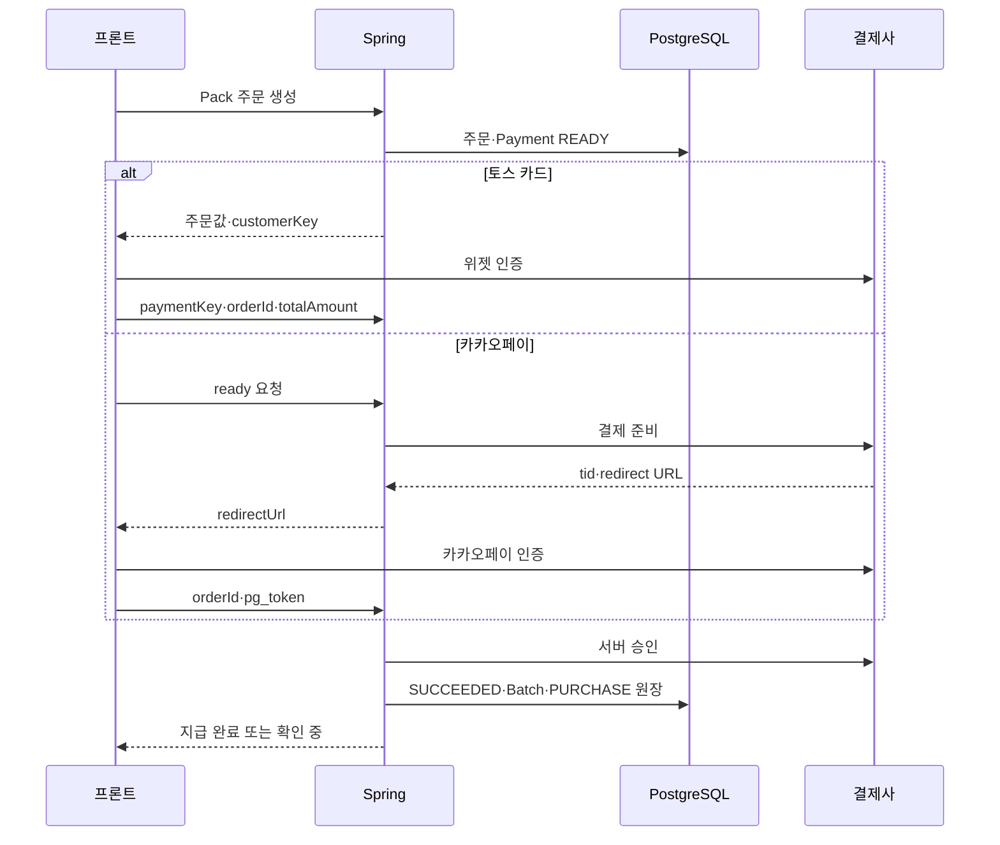
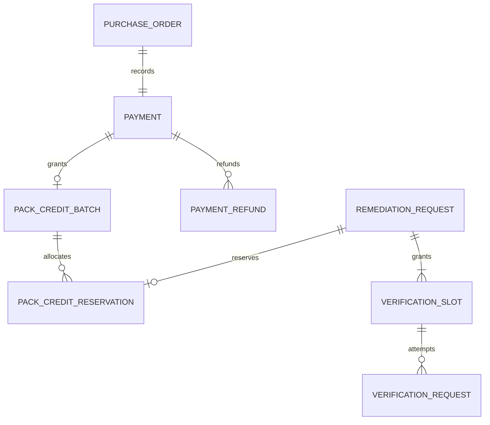
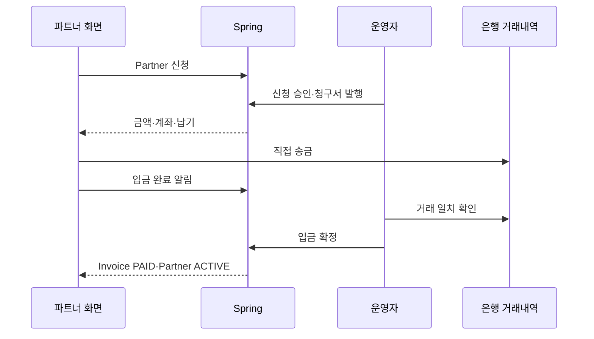

# GEO 상품·결제·Pack 사용 백엔드 명세서

- 버전: 2.0
- 작성일: 2026-09-15
- 대상: Mal-Geum GEO 서비스의 Spring Boot · Spring Security · JPA · PostgreSQL 백엔드
- 정책 기준: `PRICING_MODEL.md` 2026-09-14 개정본
- 프론트 계약: `GEO_credit_frontend_api_spec.md` v2.0
- 문서 성격: 구현용 설계 명세. 엔티티명은 제안이며 실제 코드·ERD와 병합 전 매핑 검토가 필요하다.
- 이번 산출물: 무료 Scan, Remediation Pack 결제·사용·재검증·환불의 구현 계약과 Partner 세금계산서·계좌이체의 향후 계획

## 1. 결론과 구현 범위

이번 프로젝트의 핵심 구현은 다음 흐름이다.

> 무료 Scan → Remediation Pack 주문 → 토스 카드 또는 카카오페이 승인 → Pack 크레딧 지급 → Remediation 예약·수행 → 30일 내 재수집 검증 2회

Partner는 관리 학원 수 기준 월 계약이며 세금계산서 + 수동 계좌이체를 사용한다. 기존 결정대로 Partner와 AI 검색 추적은 설계만 남기고 이번 프로젝트에서 직접 구현하지 않는다.

### 1.1 확정·설계·미확정 사항

| 구분 | 내용 | 구현 판단 |
| --- | --- | --- |
| 확정 | 주 타깃은 소형·대형 학원과 교육 파트너 | 교육 입력을 소형·대형으로 구분 |
| 확정 | 부 타깃은 이커머스·뉴스 | 같은 Pack 가격과 처리 계약 사용 |
| 확정 | `TECH_BLOG` 제외 | API enum과 모델 라우팅에서 제거 |
| 확정 | 무료 Scan: 비회원 1회, 회원 월 5회, 결과 30일 보관 | 유료 원장과 분리 |
| 확정 | Pack 1/5/20 공급가액 14,900/49,000/149,000원, VAT 별도 | 결제는 16,390/53,900/163,900원 |
| 확정 | Pack 크레딧 1개 = 페이지 1개의 전체 문제·위치별 diff·안전 검사 | 성공 시 1개 사용 확정 |
| 확정 | 성공한 Remediation에 재수집 검증 2회 | 새 Pack 크레딧 차감 없음 |
| 확정 | Pack 5·20 크레딧 12개월 유효 | 지급 시 만료일 확정 |
| 확정 | Pack 결제는 토스 카드·카카오페이 | 결제수단별 Controller·Adapter 분리 |
| 확정 | Partner는 Founding 29만원/10곳, Partner 49만원/20곳, Plus 99만원부터/50곳 | 월 공급가액, VAT 별도 |
| 확정 | Partner 기본 결제는 세금계산서 + 수동 계좌이체 | PG Payment와 다른 Invoice 도메인 |
| 확정 | AI 검색 추적은 별도 agent·서비스 | 이번 API·테이블에서 제외 |
| 설계 선택 | 재검증 기한은 Remediation 성공 시각부터 30일 | 사용자의 임의 `appliedAt`으로 기한 연장 방지 |
| 설계 선택 | 미사용 Pack만 VAT 포함 결제액 전액 자동 환불 | 일부 사용 묶음은 운영 문의 |
| 미확정 | Pack 1 미사용 크레딧 만료 | `expires_at=NULL` |
| 미확정 | Pack 구매액의 Partner 첫 달 차감 조건 | 자동 계산·원장 구현 금지 |
| 미확정 | 재검증 자체 장애 시 슬롯 복원 세부 기준 | 시스템 장애만 복원하는 기본안 사용 |

### 1.2 단계별 범위

| 단계 | 포함 | 제외 |
| --- | --- | --- |
| 프로젝트 핵심 | 상품, 주문, 토스·카카오페이 승인, Pack 원장, Remediation 예약·사용·반환 | Partner 테이블·API, AI 추적 |
| 실제 유료 공개 전 | PG Webhook·조회 대사, 장애 복구, 미사용 전액 환불, 운영 검토 | 부분 환불, 자동결제 |
| 향후 계획 | Partner 신청·청구서·입금 확인·학원별 한도 | 빌링키, PG 자동 갱신 |

외부 결제 성공과 내부 Pack 지급이 모두 확인돼야 구매가 완료된다. 정상 결제 한 번만 성공한 시연으로 실제 유료 공개 준비가 끝났다고 판단하지 않는다.

## 2. 용어와 경계

| 용어 | 의미 |
| --- | --- |
| FreeEvaluation | 제한 결과를 제공하는 무료 Scan 작업 |
| PackProduct | 판매 중인 Remediation Pack 상품과 정책 버전 |
| PurchaseOrder | Pack 한 묶음의 구매 주문·가격 스냅샷 |
| Payment | 토스·카카오페이 승인 및 취소 상태 |
| PackCreditBatch | Payment 한 건으로 지급된 Pack 크레딧 묶음 |
| PackCreditWallet | 회원별 잠금·이용 제한 기준 행 |
| PackCreditReservation | Remediation 한 건에 예약한 크레딧 1개 |
| PackCreditLedger | 지급·예약·사용·반환·환불·만료 불변 이력 |
| RemediationRequest | 한 페이지의 진단·위치별 diff·안전 검사를 생성하는 비동기 작업 |
| VerificationSlot | 성공한 Remediation에 지급되는 재수집 검증 권리 2개 |
| VerificationRequest | 사이트 적용 후 재수집·비교하는 비동기 작업 |
| Refund | 미사용 Pack 결제를 원 결제수단으로 전액 취소하는 작업 |
| PartnerApplication | Partner 계약 신청 — 계획 |
| BillingInvoice | Partner 월 공급가액·VAT·입금 계좌·납기 상태 — 계획 |
| DepositReport | 고객이 보낸 입금 완료 알림. 실제 입금 증거가 아님 — 계획 |
| PartnerSubscription | 입금 확인 뒤 활성화되는 학원 수 기준 월 권한 — 계획 |
| Reconciliation | PG·은행의 실제 거래와 내부 상태를 대조하는 복구 작업 |

기존 `AnalysisRequest`와 `AnalysisReport`가 이미 있다면 새 테이블을 무조건 복제하지 않는다. 기존 분석 주문을 `RemediationRequest` 역할로 확장할 수 있다. 단, 결제 주문과 분석 주문은 같은 엔티티로 합치지 않는다.

## 3. 타깃·도메인 계약

### 3.1 허용 도메인

```java
enum DomainType {
    EDUCATION,
    ECOMMERCE,
    NEWS
}

enum EducationSegment {
    SMALL_ACADEMY,
    LARGE_ACADEMY
}
```

- `EDUCATION`은 `educationSegment`가 필수다.
- `ECOMMERCE`, `NEWS`는 `educationSegment=NULL`이어야 한다.
- `TECH_BLOG` 요청은 `422 UNSUPPORTED_DOMAIN`이다.
- 타깃 우선순위는 가격·크레딧 지급량을 바꾸지 않는다.

### 3.2 교육 노이즈 필터

| 구분 | 기본값 | 이유 |
| --- | ---: | --- |
| `SMALL_ACADEMY` | `noiseFilterEnabled=false` | 자체 광고·홍보도 핵심 콘텐츠일 가능성이 큼 |
| `LARGE_ACADEMY` | `noiseFilterEnabled=true` | 외부 광고·배너가 평가를 왜곡할 가능성이 큼 |

클라이언트가 값을 생략하면 서버가 segment 기본값을 적용한다. 명시값은 허용하되 요청 스냅샷으로 저장한다. 정확도에 필요한 필터를 요금제 권한으로 제한하지 않는다.

DB에는 다음 CHECK를 권장한다.

```sql
CHECK (
  (domain_type = 'EDUCATION' AND education_segment IS NOT NULL)
  OR
  (domain_type IN ('ECOMMERCE', 'NEWS') AND education_segment IS NULL)
)
```

## 4. 상품·금액·세금 규칙

### 4.1 Remediation Pack

| productCode | creditQuantity | supplyAmount | vatAmount | totalAmount | validityMonths |
| --- | ---: | ---: | ---: | ---: | ---: |
| `REMEDIATION_PACK_1` | 1 | 14,900 | 1,490 | 16,390 | `NULL` — 미확정 |
| `REMEDIATION_PACK_5` | 5 | 49,000 | 4,900 | 53,900 | 12 |
| `REMEDIATION_PACK_20` | 20 | 149,000 | 14,900 | 163,900 | 12 |

1. 모든 금액은 원 단위 `long/BIGINT`, 통화는 `KRW`다. `float/double`을 사용하지 않는다.
2. Pack MVP의 `discountAmount`는 0이다.
3. `totalAmount = supplyAmount + vatAmount`를 상품 등록과 주문 생성 양쪽에서 검증한다.
4. 클라이언트는 `productCode`, `paymentMethod`만 선택한다. 가격·VAT·수량은 서버 상품에서 결정한다.
5. PurchaseOrder에 상품 코드·버전·표시명·수량·공급가액·VAT·총액·유효기간·정책 버전을 복사한다.
6. PG 승인 금액은 공급가액이 아니라 VAT 포함 `totalAmount`다.
7. PG 응답의 주문 ID·통화·총액·상점·환경을 주문 스냅샷과 다시 비교한다.
8. 상품 가격이 바뀌어도 이미 생성한 주문의 스냅샷을 변경하지 않는다.

할인·쿠폰을 추가할 때는 VAT 과세표준과 세금계산서 처리를 별도로 확정한다. Partner 첫 달 Pack 차감액을 지금의 `discountAmount`로 임의 구현하지 않는다.

### 4.2 결제수단 매핑

| paymentMethod | provider | 허용 대상 | 비고 |
| --- | --- | --- | --- |
| `CARD` | `TOSS` | Pack | 토스 주문서형 결제의 카드 전용 variant 사용 |
| `KAKAOPAY` | `KAKAOPAY` | Pack | 서버 준비 후 redirect, `pg_token` 승인 |
| `BANK_TRANSFER` | `MANUAL_BANK` | Partner Invoice | PG 실시간 계좌이체·가상계좌가 아님 |

토스 주문서형 결제는 기술적으로 다른 결제수단도 표시할 수 있지만, `CARD` 주문에서 승인 결과의 실제 method가 허용 목록과 다르면 자동 지급하지 않는다. Partner 수동 계좌이체를 토스 `계좌이체`나 `WAITING_FOR_DEPOSIT` 상태로 구현하지 않는다.

### 4.3 주문 식별자와 만료

- 공개 주문 ID는 6~64자의 무작위 문자열로 생성한다. 예: `po_<uuid>`.
- 한 PurchaseOrder에는 Pack 하나와 Payment 하나만 허용한다.
- 결제수단 변경은 기존 주문 수정이 아니라 새 주문 생성이다.
- 로컬 주문 시작 가능 시간은 기본 30분이다. PG 세션 유효시간과 별개로 기록한다.
- 로컬 주문이 만료됐어도 실제 승인 거래가 발견되면 폐기하지 않고 지급·취소·검토로 종결한다.
- 토스 `customerKey`는 회원별 무작위 고정값을 사용하고 회원 DB 순차 ID·이메일·전화번호를 그대로 쓰지 않는다.

## 5. Pack 결제 정상 흐름



### 5.1 공통 승인 트랜잭션

PG 호출과 DB 커밋은 하나의 원자적 트랜잭션이 아니다. 승인 처리는 다음 경계로 나눈다.

| 단계 | DB 작업 | 외부 호출 |
| --- | --- | --- |
| T1 승인 준비 | 소유자·주문·결제수단·총액 확인, operation token·고정 멱등키 저장, `CONFIRMING` 커밋 | 없음 |
| PG 승인 | DB 트랜잭션 없음 | provider별 승인 API |
| T2 승인 반영 | Payment 잠금·응답 재검증, `SUCCEEDED` + Batch + `PURCHASE` + Outbox 원자 커밋 | 없음 |

- T1 전 종료: 지급 없음.
- T1 후 외부 호출 전 종료: 복구 worker가 실제 거래부터 조회한다.
- PG 승인 후 T2 전 종료: 조회 결과로 T2를 재실행한다.
- T2 후 응답 유실: 같은 주문 조회에서 기존 성공을 반환한다.
- `Payment.SUCCEEDED`와 Batch 지급을 서로 다른 커밋으로 나누지 않는다.

외부 호출 timeout·5xx·연결 종료는 확정 실패가 아니다. Payment를 `UNKNOWN`으로 두고 조회 대사를 예약한다. 사용자에게 새 주문을 즉시 만들도록 유도하지 않는다.

### 5.2 토스 카드

1. 프론트가 주문의 `totalAmount`, `orderId`, `customerKey`로 주문서형 결제를 연다.
2. `successUrl`의 `paymentKey`, `orderId`, `amount`를 `POST /payments/confirm`으로 전달한다.
3. 서버는 body 금액을 주문 총액과 비교한 뒤 토스 승인 API를 호출한다.
4. 응답의 `paymentKey`, `orderId`, `totalAmount`, `currency`, 실제 method를 재검증한다.
5. `DONE`이 확인돼야 공통 T2를 실행한다.

토스 인증 뒤 승인 세션에는 시간 제한이 있으므로 successUrl 진입 직후 호출한다. 브라우저 failUrl·성공 URL 자체는 지급 근거가 아니다.

### 5.3 카카오페이 준비·승인

카카오페이는 준비와 승인을 분리한다.

#### 준비

1. `POST /payments/kakaopay/ready`에서 주문 소유자·`paymentMethod=KAKAOPAY`·미결제 상태를 검증한다.
2. DB에 Ready operation token과 요청 스냅샷을 먼저 커밋한다.
3. 트랜잭션 밖에서 카카오페이 단건 결제 준비 API를 호출한다.
4. 응답의 `tid`, PC·모바일·앱 redirect URL, 생성 시각을 Payment에 저장한다.
5. 프론트에는 실행 환경에 맞는 단일 `redirectUrl`만 반환한다.

준비 응답이 유실됐는지 모르는 상태에서 새 결제 세션을 무작정 만든다고 가정하지 않는다. provider 조회로 기존 거래를 확인할 수 있으면 조회하고, 불가능하면 기존 세션 승인 가능성을 차단·만료시킨 뒤 새 준비를 허용한다.

#### 승인

1. 카카오페이 successUrl의 `pg_token`과 보존한 `orderId`를 받는다.
2. 저장된 `tid`, 내부 주문 ID, 안정적인 가명 회원 식별자, 서버 총액으로 승인 command를 만든다.
3. `pg_token`, Secret key, CID, `tid`를 로그에 기록하지 않는다. 필요하면 `pg_token`의 해시만 요청 중복 감사값으로 남긴다.
4. timeout이면 새 `pg_token`으로 임의 재승인하지 않고 `tid` 기반 실제 주문을 조회한다.
5. 승인 응답의 거래 ID·주문·사용자·금액·상태가 일치할 때만 공통 T2를 실행한다.

카카오페이 cancelUrl·failUrl도 실제 실패 확정 근거가 아니다. 내부 주문 상태 또는 provider 조회 결과를 사용한다.

## 6. 상태 모델

### 6.1 PurchaseOrder와 Payment

`PurchaseOrder.lifecycle`은 `OPEN`, `CLOSED`, `EXPIRED`다. 결제 성공·환불 판단은 Payment가 기준이다.

| Payment 상태 | 의미 | 다음 전이 |
| --- | --- | --- |
| `READY` | 주문 생성, 승인 전 | `CONFIRMING`, `FAILED`, `EXPIRED` |
| `CONFIRMING` | 승인 작업 소유권 확보·외부 호출 중 | `SUCCEEDED`, `UNKNOWN`, `FAILED` |
| `UNKNOWN` | 승인 결과 미확정 | `SUCCEEDED`, `FAILED`, `EXPIRED`, 검토 |
| `SUCCEEDED` | 승인 검증과 Pack 지급 커밋 완료 | `PARTIALLY_REFUNDED`, `REFUNDED` |
| `PARTIALLY_REFUNDED` | 외부 부분 취소 등 정책 밖 상태 | 이용 제한·검토 |
| `REFUNDED` | 총액 전액 취소 반영 | 종료 |
| `FAILED` | provider가 확정한 승인 실패 | 종료 |
| `EXPIRED` | 신규 승인 불가 | 실제 거래 발견 시 복구 가능 |

`provider_status`, `review_required`, `provider_transaction_id`, 취소 거래는 별도로 저장한다. `UNKNOWN`과 `FAILED`를 합치지 않는다. `REFUNDED → SUCCEEDED`처럼 늦은 응답이 취소를 되돌리는 전이를 금지한다.

### 6.2 Remediation과 크레딧 예약

| Remediation | Reservation | 처리 |
| --- | --- | --- |
| `PENDING` | `RESERVED` | 사용 가능 수량에서 1개 예약 |
| `PROCESSING` | `RESERVED` | 추가 차감 없음 |
| `SUCCESS` | `CONSUMED` | 결과·diff·안전 검사 저장과 동시에 사용 확정 |
| `FAILED` | `RELEASED` | 크레딧 반환 |
| `CANCELED` | `RELEASED` | 처리 전 취소 시 반환 |

`RESERVED → CONSUMED` 또는 `RESERVED → RELEASED` 중 하나만 가능하다. 반환 후 도착한 늦은 성공 결과를 공개하거나 다시 차감하지 않는다.

### 6.3 VerificationSlot과 VerificationRequest

Remediation 성공 트랜잭션에서 slot 1, 2를 만든다.

| Slot 상태 | 의미 |
| --- | --- |
| `AVAILABLE` | 요청 가능 |
| `RESERVED` | Verification 작업에 예약 |
| `CONSUMED` | 재수집 결과가 정상 생성됨 |
| `EXPIRED` | 30일 기한 경과 |

VerificationRequest는 `PENDING`, `PROCESSING`, `SUCCESS`, `FAILED`, `EXPIRED`를 사용한다.

- 사이트에 수정안이 적용되지 않은 결과도 유효한 재검증 결과이므로 slot을 소비한다.
- 우리 크롤러·서버·모델의 확정 장애로 결과를 만들지 못하면 slot을 `AVAILABLE`로 반환한다.
- 장애 원인이 불명확하면 자동 반환하지 않고 검토 대상으로 남긴다.
- 같은 slot은 한 번에 하나의 진행 중 Verification에만 연결한다.
- 기한은 기본 `remediation.completed_at + 30일`이며 UTC로 저장한다.

### 6.4 Refund

| Refund 상태 | Batch 수량 | 처리 |
| --- | --- | --- |
| `REQUESTED` | A→H | 취소 Outbox 생성 |
| `PROCESSING` | H 유지 | provider 취소 호출 |
| `UNKNOWN` | H 유지 | 실제 취소 조회 |
| `SUCCEEDED` | H→F | 취소 거래·원장 확정 |
| `FAILED` | H→A | 취소 미실행이 확정된 경우만 반환 |

### 6.5 FreeEvaluation

`PENDING`, `PROCESSING`, `SUCCESS`, `FAILED`, `EXPIRED`를 사용한다. 결과 30일 보관 만료는 작업 실패가 아니라 `EXPIRED`다.

## 7. 무료 Scan

### 7.1 결과 범위

- 점수
- 우선순위 상위 문제 3개
- 그중 1개만 위치·근거 상세
- 이미지 의존 경고
- 결과 보관 30일

제한된 두 문제의 selector·근거·수정안은 API에서 `NULL`로 반환한다. 숨길 필드를 전체 응답에 넣고 프론트 CSS로 가리는 방식은 사용하지 않는다.

무료 결과를 결제 후 그대로 전체 공개하지 않는다. Pack 크레딧으로 새 Remediation을 생성해야 한다.

### 7.2 사용량 제한

| 사용자 | 한도 | 서버 기준 |
| --- | --- | --- |
| 비회원 | 1회 | 구체적인 재허용 기간 미확정 |
| 회원 | 월 5회 | `Asia/Seoul` 달력 월 기준 제안 |
| 파트너 영업용 일괄 Scan | 별도 | 관리자·영업 권한 경로, 일반 API와 분리 |

형식 오류·지원하지 않는 도메인처럼 작업이 생성되지 않은 요청은 한도를 사용하지 않는다. `202`로 접수된 작업은 이후 실패해도 남용 방지를 위해 기본적으로 한도에 포함한다. 시스템 장애 보상 규칙은 운영 정책으로 분리한다.

비회원 식별을 단순 IP 하나로만 결정하지 않는다. 브라우저 토큰, IP 기반 속도 제한, CAPTCHA 등 여러 신호를 조합하되 개인정보 보관 근거와 기간을 확정한다. 비회원 조회 토큰은 충분히 무작위여야 하고 원문 저장 대신 해시 저장을 우선한다.

### 7.3 비동기 처리

`POST /evaluate`는 영속 FreeEvaluation을 생성하고 `202`를 반환한다. worker가 단일 처리 용량에 맞춰 `PENDING → PROCESSING`으로 전이한다. 프로세스 메모리의 `@Async`만으로 큐를 만들지 않는다.

## 8. Pack 크레딧과 Remediation

### 8.1 Batch 불변식

각 PackCreditBatch에 다음 수량을 저장한다.

| 기호 | 필드 | 의미 |
| --- | --- | --- |
| Q | granted_quantity | 최초 지급 |
| A | available_quantity | 사용 가능 |
| R | reserved_quantity | Remediation 예약 |
| C | consumed_quantity | 성공 작업 사용 |
| H | refund_held_quantity | 환불 보류 |
| F | refunded_quantity | 환불 완료 |
| E | expired_quantity | 만료 |

항상 `Q = A + R + C + H + F + E`이며 모든 수량은 0 이상이다.

| 원장 eventType | 수량 변화 | eventKey |
| --- | --- | --- |
| `PURCHASE` | Q+q, A+q | `purchase:{paymentId}` |
| `RESERVE` | A-1, R+1 | `reserve:{remediationId}` |
| `CONSUME` | R-1, C+1 | `consume:{reservationId}` |
| `RELEASE` | R-1, A+1 | `release:{reservationId}` |
| `REFUND_HOLD` | A-q, H+q | `refund-hold:{refundId}` |
| `REFUND` | H-q, F+q | `refund:{refundId}` |
| `REFUND_RELEASE` | H-q, A+q | `refund-release:{refundId}` |
| `EXPIRE` | A-q, E+q | `expire:{batchId}:{scheduleDate}` |

원장 행은 UPDATE·DELETE하지 않는다. 보정은 원인·운영자·연관 사건을 가진 새 이벤트로 기록한다.

### 8.2 Batch 선택과 만료

1. Wallet을 비관적 쓰기 잠금한다.
2. 차단되지 않고 `expires_at > now OR expires_at IS NULL`인 Batch만 본다.
3. 만료 시각이 빠른 Batch부터, NULL은 마지막으로 선택한다.
4. 동일 만료면 지급 시각과 ID 순으로 선택한다.
5. A가 1 이상이면 Remediation·Reservation·RESERVE를 같은 트랜잭션으로 저장한다.

Pack 5·20은 실제 지급 시각에서 `Asia/Seoul` 달력 기준 12개월 후를 계산해 UTC로 저장한다. 단순 365일과 혼용하지 않는다. Pack 1은 정책 확정 전 `NULL`이다.

만료 전에 예약된 R은 작업 종결까지 보호한다. 실패 반환 시 이미 만료 시각이 지났으면 RELEASE와 EXPIRE를 같은 트랜잭션에 기록한다.

### 8.3 Remediation 성공 기준

크레딧 사용 확정은 다음이 모두 조회 가능하게 저장된 시점이다.

1. 전체 문제와 근거
2. 위치 selector 또는 Schema path
3. HTML·JSON-LD·텍스트 수정 diff
4. 구문·Schema·본문 일치 안전 검사 결과
5. 리포트·patchSet 연결
6. VerificationSlot 2개와 기한

점수만 생성되거나 개선안 JSON이 잘린 경우 성공이 아니다. 변경이 필요 없으면 빈 결과 대신 `NO_CHANGE_NEEDED`와 검증 근거를 저장한다.

### 8.4 실패·재시도·알림

- `attempt_no`, `next_attempt_at`, `lease_until`, `execution_token`, AI `remote_job_id`를 영속화한다.
- 기본 시도 한도는 최초 포함 3회인 설계값이며 운영 측정 후 조정한다.
- AI 서버는 같은 Remediation ID의 중복 제출을 기존 remote job에 연결해야 한다.
- lease 만료는 작업 종료 증거가 아니다. remote job을 먼저 조회한다.
- 최신 execution token과 `Reservation.RESERVED`를 모두 검사한 결과만 반영한다.
- 크롤링 차단·입력 초과·모델 최종 실패는 크레딧 반환 대상이다.
- 이메일·문자 알림 실패는 Remediation 성공과 크레딧 사용을 되돌리지 않는다. Outbox로 재시도한다.

### 8.5 재검증 요청

1. Remediation 소유자·`SUCCESS`·검증 기한을 확인한다.
2. Remediation을 잠근 뒤 가장 낮은 번호의 `AVAILABLE` slot을 `RESERVED`로 바꾼다.
3. VerificationRequest와 idempotency 응답을 같은 트랜잭션으로 저장한다.
4. worker가 원래 URL을 다시 수집한다. 클라이언트가 URL을 바꾸지 못한다.
5. 적용 diff와 현재 페이지를 비교하고 재평가 결과를 저장한다.
6. 성공은 slot `CONSUMED`, 확정 시스템 실패는 `AVAILABLE`로 전이한다.

`appliedAt`은 고객 표시·분석용 메타데이터일 뿐 검증 기한이나 권한 판단의 신뢰값으로 사용하지 않는다.

## 9. Pack 환불

### 9.1 자동 전액 환불 조건

| 상품 | 조건 | 환불 총액 |
| --- | --- | ---: |
| Pack 1 | Q=A=1, R=C=H=F=E=0 | 16,390원 |
| Pack 5 | Q=A=5, R=C=H=F=E=0 | 53,900원 |
| Pack 20 | Q=A=20, R=C=H=F=E=0 | 163,900원 |

Payment가 `SUCCEEDED`이고 해당 Batch가 전량 미사용일 때만 provider에 VAT 포함 총액 전액 취소를 요청한다. 일부 사용·예약·만료된 묶음은 PG가 부분 취소를 지원하더라도 자동 환불하지 않는다.

자동 처리 범위 밖이라는 응답을 법적 환불 불가라고 표현하지 않는다. 사유 코드와 문의 경로를 제공한다.

### 9.2 환불 트랜잭션

1. T1에서 Wallet → Payment → Batch 순으로 잠근다.
2. 전량 미사용·미환불을 다시 검사한다.
3. A 전체를 H로 옮기고 Refund·REFUND_HOLD·Outbox를 원자 커밋한다.
4. 트랜잭션 밖에서 provider별 전액 취소를 호출한다.
5. 성공 T2는 H→F, REFUND, 취소 거래 키와 누계, Payment `REFUNDED`를 함께 반영한다.
6. 확정 실패는 H→A와 REFUND_RELEASE를 한 번만 반영한다.
7. timeout·응답 유실은 H를 유지하고 `UNKNOWN`으로 조회 대사한다.

`Payment.refunded_amount_krw`는 확인된 취소 거래 누계다. 같은 provider 취소 거래 키를 다시 수신해도 증가시키지 않는다. `0 ≤ refunded ≤ totalAmount`를 보장한다.

### 9.3 외부 취소

우리 Refund 없이 취소가 관찰되면 `review_required=true`와 Wallet 이용 제한을 기록한다. 전량 미사용 전액 취소만 자동 원장 복구할 수 있다. 이미 사용한 Pack의 부분·전액 외부 취소는 음수 잔액이나 과거 원장 삭제로 맞추지 않고 운영 검토로 보낸다.

Partner 계좌이체 해지·과오납 반환은 Pack Refund를 사용하지 않는다.

## 10. API 계약

### 10.1 공통 규칙

- Base path는 `/api/v1`.
- 회원 API는 `Authorization: Bearer <accessToken>`.
- 회원 ID는 Principal에서 얻고 body에 받지 않는다.
- 다른 회원의 리소스는 404로 응답한다.
- 생성·승인·취소 POST는 `Idempotency-Key`가 필수다.
- 같은 키·같은 정규화 body는 같은 리소스와 기존 결과를 반환한다.
- 같은 키·다른 body는 `409 IDEMPOTENCY_KEY_REUSED`다.
- 목록은 `(created_at,id)` 역순 cursor, 기본 20·최대 100이다.
- 시간은 ISO 8601 UTC, 금액은 KRW 정수다.

공통 오류:

```json
{
  "code": "INSUFFICIENT_PACK_CREDITS",
  "message": "사용 가능한 Pack 크레딧이 부족합니다.",
  "retryable": false,
  "resourceId": null,
  "traceId": "trace_4ca2"
}
```

### 10.2 프로젝트 구현 API

| 메서드·경로 | 인증 | 핵심 역할 |
| --- | --- | --- |
| POST `/evaluate` | 선택 | 무료 Scan 접수 |
| GET `/evaluations/{evaluationId}` | 소유자·비회원 조회 토큰 | Scan 상태·제한 결과 |
| GET `/pack-products` | 공개 | 판매 Pack·공급가액·VAT·총액 |
| POST `/purchase-orders` | 회원 | Pack 주문·Payment 생성 |
| GET `/purchase-orders/{orderId}` | 소유자 | 주문·결제·지급·환불 상태 |
| GET `/purchase-orders` | 회원 | Pack 구매 이력 |
| POST `/payments/confirm` | 소유자 | 토스 카드 승인 |
| POST `/payments/kakaopay/ready` | 소유자 | 카카오페이 준비·redirect URL |
| POST `/payments/kakaopay/approve` | 소유자 | 카카오페이 승인 |
| GET `/pack-credits/balance` | 회원 | 가용·예약·환불 보류 잔액 |
| GET `/pack-credits/batches` | 회원 | 구매별 잔액·만료 |
| GET `/pack-credits/ledger` | 회원 | Pack 원장 |
| POST `/remediations` | 회원 | 크레딧 1개 예약·작업 접수 |
| GET `/remediations/{remediationId}` | 소유자 | 작업·결과·재검증 권리 |
| POST `/remediations/{remediationId}/cancel` | 소유자 | PENDING 작업 취소 — 선택 |
| POST `/remediations/{remediationId}/verifications` | 소유자 | 무료 재수집 검증 접수 |
| GET `/verifications/{verificationId}` | 소유자 | 재검증 상태·비교 결과 |
| GET `/payments/{paymentId}/refund-eligibility` | 소유자 | 미사용 전액 환불 가능 확인 |
| POST `/payments/{paymentId}/refunds` | 소유자 | provider 전액 취소 접수 |
| GET `/refunds/{refundId}` | 소유자 | 환불 상태 |

### 10.3 운영·복구 API

| 메서드·경로 | 인증 | 역할 |
| --- | --- | --- |
| POST `/webhooks/payments/toss` | PG 통지 | 영속 수신 후 빠른 2xx |
| POST `/webhooks/payments/kakaopay` | provider 통지 | 계약·검증 방식이 확인된 경우만 활성화 |
| GET `/admin/payment-reviews` | 관리자 | 장기 미확정·외부 취소·금액 불일치 |
| POST `/admin/payments/{paymentId}/reconcile` | 관리자 | 실제 provider 조회 작업 재예약 |
| GET `/admin/remediation-reviews` | 관리자 | lease·remote job·원장 불일치 |

관리자 API는 UI 숨김이 아니라 서버 권한 검사·감사 로그가 필요하다. 임의 Payment 성공·임의 무제한 크레딧 지급 버튼은 만들지 않는다.

### 10.4 Pack 주문 생성

```http
POST /api/v1/purchase-orders
Authorization: Bearer <accessToken>
Idempotency-Key: b30fb259-46f0-4a10-8d06-f14a73fe3a67
Content-Type: application/json

{
  "productCode": "REMEDIATION_PACK_5",
  "paymentMethod": "CARD"
}
```

```json
{
  "orderId": "po_67b1e630-8460-4c45-b99b-5b238a136cde",
  "orderName": "Remediation Pack 5",
  "productCode": "REMEDIATION_PACK_5",
  "creditQuantity": 5,
  "supplyAmount": 49000,
  "vatAmount": 4900,
  "discountAmount": 0,
  "totalAmount": 53900,
  "currency": "KRW",
  "paymentMethod": "CARD",
  "paymentProvider": "TOSS",
  "checkout": {
    "type": "TOSS_WIDGET",
    "customerKey": "5b7d49ac-608f-4d6a-b245-d8a3b6f97c32"
  },
  "paymentMode": "TEST",
  "expiresAt": "2026-09-15T06:30:00Z",
  "policyVersion": "pricing-2026-09-14"
}
```

`BANK_TRANSFER`는 이 API에서 `409 BANK_TRANSFER_NOT_ALLOWED_FOR_PACK`이다.

### 10.5 토스 승인

```json
{
  "orderId": "po_67b1e630-8460-4c45-b99b-5b238a136cde",
  "paymentKey": "<토스 paymentKey>",
  "amount": 53900
}
```

amount는 비교용이며 서버는 주문의 `totalAmount=53900`을 승인 command에 사용한다. paymentKey가 주문에 결합되면 다른 키로 바꿀 수 없다.

### 10.6 카카오페이 준비·승인

준비 요청:

```json
{
  "orderId": "po_b7845e83-12f1-44a6-ad84-1d47d39fc743",
  "clientType": "WEB_PC"
}
```

준비 응답:

```json
{
  "orderId": "po_b7845e83-12f1-44a6-ad84-1d47d39fc743",
  "paymentId": "pay_539640c1",
  "paymentStatus": "READY",
  "redirectUrl": "https://online-pay.kakao.com/...",
  "expiresAt": "2026-09-15T06:30:00Z"
}
```

승인 요청:

```json
{
  "orderId": "po_b7845e83-12f1-44a6-ad84-1d47d39fc743",
  "pgToken": "<successUrl의 pg_token>"
}
```

클라이언트에서 CID·Secret key·`tid`·금액·회원 ID를 받지 않는다.

### 10.7 공통 승인 응답

성공 `200`:

```json
{
  "orderId": "po_67b1e630-8460-4c45-b99b-5b238a136cde",
  "paymentId": "pay_1d8ef273",
  "paymentMethod": "CARD",
  "paymentStatus": "SUCCEEDED",
  "creditGranted": true,
  "grantedQuantity": 5,
  "availablePackCredits": 5
}
```

미확정 `202`:

```json
{
  "orderId": "po_67b1e630-8460-4c45-b99b-5b238a136cde",
  "paymentStatus": "UNKNOWN",
  "creditGranted": false,
  "pollUrl": "/api/v1/purchase-orders/po_67b1e630-8460-4c45-b99b-5b238a136cde",
  "retryAfterSeconds": 3
}
```

### 10.8 Remediation·재검증

Remediation 요청:

```json
{
  "url": "https://academy.example.com/curriculum",
  "domainType": "EDUCATION",
  "educationProfile": {
    "segment": "LARGE_ACADEMY",
    "noiseFilterEnabled": true
  },
  "notificationChannels": ["EMAIL"]
}
```

접수 `202`는 `remediationId`, `PENDING`, `RESERVED`, `reservedCredits=1`, 잔액, pollUrl을 반환한다. 성공 조회는 최소 `reportId`, `patchSetId`, `safetyCheckStatus`, `verificationRemaining=2`, `verificationExpiresAt`을 반환한다.

재검증 요청 body의 `appliedAt`은 선택 메타데이터다. 서버는 원 Remediation URL과 diff를 사용하고, 응답에 `packCreditsCharged=0`, 남은 slot 수를 포함한다.

### 10.9 오류 매핑

| HTTP | code | 백엔드 처리 |
| ---: | --- | --- |
| 400 | `INVALID_REQUEST` | 필드·형식 오류 |
| 400 | `IDEMPOTENCY_KEY_REQUIRED` | POST 처리 전 거절 |
| 400 | `EDUCATION_SEGMENT_REQUIRED` | EDUCATION segment 누락 |
| 401 | `UNAUTHORIZED` | 인증 필요 |
| 403 | `ACCOUNT_RESTRICTED` | 결제·원장 검토 계정 |
| 404 | `RESOURCE_NOT_FOUND` | 없음 또는 다른 소유자 |
| 409 | `IDEMPOTENCY_KEY_REUSED` | 동일 키·다른 body |
| 409 | `ORDER_EXPIRED` | 신규 승인 금지 |
| 409 | `AMOUNT_MISMATCH` | provider 호출 전 차단 |
| 409 | `PAYMENT_KEY_CONFLICT` | 기존 토스 키와 불일치 |
| 409 | `PAYMENT_PROVIDER_MISMATCH` | 주문 결제수단 불일치 |
| 409 | `PAYMENT_SESSION_EXPIRED` | provider 세션 만료 |
| 409 | `BANK_TRANSFER_NOT_ALLOWED_FOR_PACK` | Pack 수동이체 금지 |
| 409 | `DEPOSIT_ALREADY_REPORTED` | 같은 Partner 입금 알림 중복 — 계획 |
| 409 | `INSUFFICIENT_PACK_CREDITS` | Remediation 생성 안 함 |
| 409 | `REMEDIATION_ALREADY_STARTED` | 처리 전 취소 시점 경과 |
| 409 | `VERIFICATION_LIMIT_EXCEEDED` | 사용 가능한 slot 없음 |
| 409 | `VERIFICATION_WINDOW_EXPIRED` | 기한 경과 |
| 409 | `CREDITS_IN_USE` | 환불과 예약 경쟁 |
| 409 | `CREDITS_ALREADY_USED` | 자동 전액 환불 불가 |
| 409 | `NO_REFUNDABLE_CREDITS` | 환불 가능 수량 없음 |
| 409 | `REFUND_REVIEW_REQUIRED` | 자동 처리 중단 |
| 422 | `PAYMENT_DECLINED` | provider가 확정한 실패 |
| 422 | `UNSUPPORTED_URL` | URL 정책 위반 |
| 422 | `UNSUPPORTED_DOMAIN` | 허용 enum 아님 |
| 429 | `FREE_SCAN_LIMIT_EXCEEDED` | 무료 Scan 한도 초과 |
| 429 | `QUEUE_FULL` | 영속 작업 생성·크레딧 예약 안 함 |
| 503 | `TEMPORARILY_UNAVAILABLE` | 상태 기록 전 장애 |

## 11. 구현 데이터 모델

### 11.1 공통 원칙

- PK는 기존 프로젝트 규칙을 따른다.
- 외부 공개 ID는 추측하기 어려운 별도 UUID 문자열을 권장한다.
- 시간은 PostgreSQL `timestamptz`.
- enum은 JPA `EnumType.STRING`과 `VARCHAR` CHECK를 기본으로 한다.
- PostgreSQL 고유 enum과 ordinal을 혼용하지 않는다.
- 운영 마이그레이션은 Flyway 등 현재 도구로 관리하고 `ddl-auto=validate`를 사용한다.

### 11.2 핵심 테이블

| 테이블 | 주요 필드 | 필수 제약 |
| --- | --- | --- |
| `pack_product` | code, name, version, quantity, supply_amount, vat_amount, total_amount, currency, validity_months nullable, verification_count, verification_window_days, active, policy_version | code UNIQUE, 금액·수량 양수, total=supply+vat |
| `purchase_order` | public_id, member_id, product snapshot, payment_method, payment_provider, supply/vat/discount/total snapshot, policy_version, lifecycle, expires_at, created_at | public_id UNIQUE, total>0, 회원 FK |
| `payment` | purchase_order_id, provider, environment, merchant_id, provider_transaction_id nullable, status, provider_status, total_amount, refunded_amount, approved_at, grant_applied_at, operation_token, lease_until, next_check_at, review_required | order UNIQUE, provider 거래 식별 UNIQUE, 0≤refunded≤total |
| `pack_credit_wallet` | member_id, toss_customer_key, restricted, reason, updated_at | member_id PK/FK, customer key UNIQUE |
| `pack_credit_batch` | member_id, payment_id, Q/A/R/C/H/F/E, granted_at, expires_at nullable, blocked | payment_id UNIQUE, 수량 비음수, Q 합계 CHECK |
| `pack_credit_reservation` | remediation_id, batch_id, member_id, quantity, state, reserved_at, finalized_at | remediation_id UNIQUE, quantity=1 |
| `pack_credit_ledger` | member_id, batch_id, event_key, event_type, delta Q/A/R/C/H/F/E, remediation_id, refund_id, reason, actor, created_at | event_key UNIQUE, UPDATE·DELETE 금지 |
| `remediation_request` | public_id, member_id, url, normalized_url_hash, domain_type, education_segment, noise_filter_enabled, status, job recovery fields, report_id, patch_set_id, verification_expires_at | public_id UNIQUE, 도메인 CHECK |
| `verification_slot` | remediation_id, slot_no, status, current_verification_id nullable, expires_at | (remediation_id,slot_no) UNIQUE, slot_no IN (1,2) |
| `verification_request` | public_id, remediation_id, slot_id, member_id, status, applied_at, job recovery fields, result_id, failure_code | public_id UNIQUE, 진행 상태의 slot_id 부분 UNIQUE |
| `payment_refund` | payment_id, batch_id, member_id, quantity, amount, status, reason, pg_idempotency_key, provider_cancel_key, retry fields | 진행 환불 payment당 최대 1개, MVP 전액 |
| `api_idempotency` | member_or_subject, operation_scope, idem_key, request_hash, resource_id, state, response snapshot, timestamps | subject+scope+key UNIQUE |
| `free_evaluation` | public_id, member_id nullable, anonymous_subject_hash nullable, url, domain fields, status, result fields, expires_at, job recovery fields | 정확히 한 subject, 도메인 CHECK |
| `free_scan_usage` | member_or_subject, period_key, evaluation_id, accepted_at | evaluation_id UNIQUE, 한도 조회 인덱스 |
| `payment_webhook_inbox` | provider, environment, transmission_id nullable, payload_hash, protected_payload, status, retry fields | provider 범위 중복 방지 |
| `outbox_event` | event_key, aggregate, event_type, protected_payload, state, retry fields | event_key UNIQUE |

카카오페이 `tid`와 토스 `paymentKey`는 `provider_transaction_id`로 정규화하되 provider별 길이·형식은 어댑터가 검증한다. provider 원문 응답은 꼭 필요한 필드만 정규화해 저장하고, 원문 보관이 필요하면 암호화·접근·삭제 정책을 별도로 둔다.

### 11.3 관계



지급 전 Payment에는 Batch가 없다. FreeEvaluation에는 Batch·Reservation이 없다. member_id 일치는 서비스 계층과 가능한 복합 FK로 모두 보호한다.

### 11.4 인덱스

- 구매 목록: `(member_id, created_at DESC, id DESC)`.
- Batch 선택: `(member_id, expires_at, granted_at, id)` + 가용·차단 필터.
- 원장 목록: `(member_id, created_at DESC, id DESC)`.
- Remediation 큐: `(status, next_attempt_at, created_at, id)`.
- Verification 큐: `(status, next_attempt_at, created_at, id)`.
- Payment 복구: `(status, next_check_at)`.
- Refund·Inbox·Outbox: `(status/state, next_attempt_at)`.
- 진행 환불 부분 UNIQUE: `payment_id WHERE status IN ('REQUESTED','PROCESSING','UNKNOWN')`.
- Free Scan 회원 한도: `(member_id, period_key, accepted_at)`.
- 비회원 한도: `(anonymous_subject_hash, accepted_at)`.

## 12. 동시성·멱등성

### 12.1 잠금 순서

구현 범위의 기본 잠금 순서는 다음과 같다.

> Wallet → Payment → Batch(ID 순) → Remediation → Reservation → VerificationSlot → VerificationRequest → Refund

- 후보를 조회한 뒤 실제 전이 트랜잭션에서 다시 조건을 검사한다.
- 잔액을 읽고 Java에서 1을 빼서 저장하는 방식만 사용하지 않는다.
- 사용자 취소와 worker 시작은 조건부 전이로 승자 하나만 만든다.
- PG·AI·이메일 네트워크 호출 중 DB 잠금을 유지하지 않는다.
- 데드락·잠금 timeout은 짧은 DB 트랜잭션만 제한 재시도한다.

Wallet은 가입 시 만들고 기존 회원은 마이그레이션으로 채운다. 존재하지 않는 행을 `SELECT FOR UPDATE`했다고 회원별 직렬화가 성립한다고 가정하지 않는다.

### 12.2 중복 방지 계층

| 계층 | 유일성 | 보호 대상 |
| --- | --- | --- |
| HTTP API | subject + operation scope + idempotency key + request hash | 더블클릭·네트워크 재전송 |
| 비즈니스 DB | order당 Payment, payment당 Batch, remediation당 Reservation, ledger eventKey | 서로 다른 HTTP 키·Webhook·대사 |
| provider | 승인·취소 operation별 저장된 키 | 외부 중복 호출 |
| worker | execution token + lease + remote job ID | AI 중복 실행·늦은 결과 |
| 재검증 | remediation+slotNo UNIQUE + slot 조건 전이 | 2회 초과·동시 요청 |

HTTP idempotency 행과 생성 리소스를 같은 트랜잭션에 연결한다. 인증·소유자 검사를 캐시된 응답 반환보다 먼저 한다. HTTP 키 보관은 최소 30일의 설계값을 사용하되 미종결 거래의 비즈니스 유일성은 영구 제약으로 유지한다.

## 13. 결제 어댑터

provider별 준비·승인 입력이 다르므로 Controller DTO를 하나의 nullable 필드 묶음으로 만들지 않는다. 공통화 지점은 검증된 결과의 내부 반영이다.

```java
interface PaymentGateway {
    PaymentProvider provider();
    PaymentSnapshot query(QueryPaymentCommand command);
    CancelResult cancel(CancelCommand command);
}

interface TossPaymentGateway extends PaymentGateway {
    ApprovalResult confirm(TossConfirmCommand command);
}

interface KakaoPayGateway extends PaymentGateway {
    KakaoReadyResult ready(KakaoReadyCommand command);
    ApprovalResult approve(KakaoApproveCommand command);
}
```

`ApprovalResult`와 `PaymentSnapshot`은 최소한 성공/확정 실패/불확실, provider 거래 ID, 주문 ID, 금액, 통화, method, 원상태, 승인 시각, 취소 누계를 구분한다.

### 13.1 토스 매핑

| 작업 | 공식 API 의미 | 저장·검증 |
| --- | --- | --- |
| 승인 | paymentKey·orderId·amount 승인 | 주문 총액·통화·method 검증 |
| paymentKey 조회 | 단일 Payment 조회 | 승인·취소 복구 |
| orderId 조회 | 주문 기준 조회 | paymentKey 유실 복구 |
| 취소 | paymentKey 기준 취소 | Refund 고정 멱등키·총액 |

### 13.2 카카오페이 매핑

| 작업 | 공식 API 의미 | 저장·검증 |
| --- | --- | --- |
| 준비 | 내부 주문·회원·금액·반환 URL | `tid`, redirect URL, 생성 시각 |
| 승인 | 저장 `tid` + `pg_token` + 동일 주문·회원 | 승인 금액·주문·상태 |
| 주문 조회 | 저장된 provider 식별자 기준 | timeout·응답 유실 복구 |
| 취소 | 승인 거래 기준 | Refund 총액·취소 결과 |

정확한 HTTP 경로·인증 헤더·필드명은 계약한 카카오페이 API 버전의 DTO에 캡슐화한다. 도메인 서비스가 CID·Secret key·`pg_token`을 알게 하지 않는다.

### 13.3 비밀값

- 토스 시크릿 키, 카카오페이 Secret key·CID는 서버 Secret 관리에 둔다.
- 테스트·운영 키, MID/CID, Webhook URL, DB를 가능한 분리한다.
- 카드번호·CVC·비밀번호를 백엔드 DTO·DB에 받거나 저장하지 않는다.
- `pg_token`, provider 인증 헤더, business secret을 로그·trace·예외 메시지에 포함하지 않는다.

## 14. Webhook·대사·복구

### 14.1 Webhook Inbox

1. provider별 전용 HTTPS 경로에서 본문 크기·형식·허용 이벤트를 검사한다.
2. 전송 ID 또는 payload hash로 Inbox에 영속 기록한다.
3. Inbox 커밋 뒤 빠르게 2xx를 응답한다.
4. worker가 저장된 내부 주문과 provider API 조회 결과를 비교한다.
5. 검증된 snapshot만 `applyVerifiedPaymentSnapshot`에 넘긴다.
6. 중복 지급은 Payment당 Batch UNIQUE와 PURCHASE eventKey가 최종 차단한다.

Webhook payload의 성공 문자열만 보고 Pack을 지급하지 않는다. Webhook 지원·인증 방법이 공식 계약에서 확인되지 않은 provider 경로는 만들지 않는다.

### 14.2 순서 역전

클라이언트 승인 응답, Webhook, 주기 대사는 같은 검증·반영 서비스로 들어간다. 외부 조회 전 `mutation_version`과 operation token을 읽고, 반영 시 다시 잠가 값이 바뀌었으면 snapshot을 그대로 적용하지 않는다.

늦은 승인 응답은 확인된 취소 누계를 줄이거나 `REFUNDED`를 되돌릴 수 없다. 같은 Payment의 승인·취소·대사는 하나의 영속 작업 소유권으로 직렬화한다.

### 14.3 초기 복구 주기

| 대상 | 기본값 |
| --- | --- |
| Payment `CONFIRMING/UNKNOWN` | 1분 스캔 + 지수 백오프 |
| Refund `REQUESTED/PROCESSING/UNKNOWN` | Outbox + 1분 누락 복구 |
| Remediation·Verification lease 만료 | remote job 조회 후 재개 |
| Inbox·Outbox 실패 | 1→5→15→60분, 이후 검토 |
| 30분 이상 결제 미확정 | 관리자 알림, 자동 실패 금지 |
| provider 성공·DB 미지급 | 검증 후 T2 재실행 |
| provider 취소·DB 미반영 | 취소 거래 키 검증 후 환불 반영 |
| 수량·금액 불변식 불일치 | Wallet 제한·운영 검토 |

운영 데이터가 없는 초기값이며 외부 SLA가 아니다.

## 15. Spring 구성

마이크로서비스를 새로 만들지 않고 현재 Spring 애플리케이션의 모듈·패키지를 분리한다.

| 구성요소 | 책임 |
| --- | --- |
| `PackCatalogService` | 상품·정책 버전·VAT 포함 총액 제공 |
| `PurchaseOrderService` | 주문 스냅샷·payment method 검증 |
| `PaymentApplicationService` | provider 호출 전후 조정 |
| `PaymentTransactionService` | 짧은 T1/T2 트랜잭션 |
| `TossPaymentGateway` | 토스 승인·조회·취소 DTO |
| `KakaoPayGateway` | 카카오 준비·승인·조회·취소 DTO |
| `PackCreditService` | Batch 선택·예약·소비·반환·환불 수량 |
| `RemediationService` | 작업 접수·상태·결과 반영 |
| `VerificationService` | 2개 slot 예약·재수집 결과 |
| `FreeEvaluationService` | 무료 한도·제한 결과·보관 |
| `RefundApplicationService` | 환불 보류·provider 취소·복구 |
| `WebhookInboxService` | provider 통지 영속 수신 |
| `ReconciliationWorker` | 실제 거래 조회·불일치 복구 |
| `OutboxWorker` | 환불·알림 등 영속 작업 |

`@Transactional` 안에서 PG·AI HTTP 호출을 실행하지 않는다. 같은 클래스의 self-invocation에 `@Transactional`을 붙였다고 새 경계가 생긴다고 가정하지 않는다. 별도 Bean 또는 `TransactionTemplate`을 사용한다.

공통 승인 의사코드:

```text
approve(principal, providerRequest, apiIdempotencyKey):
  prepared = tx.prepareApproval(principal, providerRequest, apiIdempotencyKey)
  if prepared.alreadyCompleted: return prepared.existingResult
  if prepared.ownedByOtherWorker: return 202 + orderStatusUrl

  result = approvalExecutor.execute(prepared.command)  // provider별 호출, DB TX 밖

  if result.verifiedSuccess:
      return tx.applyApprovalAndGrant(result, prepared.operationToken)
  if result.definitiveFailure:
      return tx.applyFailure(result, prepared.operationToken)

  tx.markUnknownAndScheduleQuery(prepared.operationToken)
  return 202 + orderStatusUrl
```

토스 `confirm`과 카카오 `approve` 호출 자체는 서로 다른 메서드지만 결과 반영은 동일 경로를 사용한다.

## 16. 보안·개인정보·운영

- 모든 회원 리소스 명령·조회는 소유자를 검사한다. UUID가 권한 검사를 대체하지 않는다.
- CORS는 실제 프론트 origin과 `Authorization`, `Content-Type`, `Idempotency-Key`만 필요한 범위로 허용한다.
- 상품 가격·VAT·크레딧·환불액·주문 소유자는 서버 기준이다.
- 크롤링 URL은 http/https만 허용하고 loopback·사설 IP·link-local·클라우드 메타데이터를 DNS 해석과 redirect마다 차단한다.
- URL의 민감 query, 연락처, 토큰, provider secret은 로그에서 마스킹한다.
- 알림은 인증 계정 연락처를 사용하고 요청 body로 임의 제3자 연락처를 받지 않는다.
- Payment·원장 기록을 회원 탈퇴와 함께 연쇄 삭제하지 않는다. 개인정보 분리·보관 정책을 적용한다.
- 테스트 결제와 운영 결제를 화면·키·DB 필드로 구분한다.
- 운영자는 미확정 거래를 조회·재대사할 수 있지만 근거 없이 성공 처리하지 못한다.
- 핵심 잠금·부분 인덱스·CHECK 테스트는 실제 PostgreSQL에서 수행한다. H2만으로 동시성 검증을 끝내지 않는다.

## 17. Partner·세금계산서·수동 계좌이체 — 계획

### 17.1 상품 계약

| planCode | 월 공급가액 | VAT 포함 | 포함 학원 | 학원당 월 페이지 | 조건 |
| --- | ---: | ---: | ---: | ---: | --- |
| `FOUNDING_PARTNER` | 290,000 | 319,000 | 10 | 10 | 첫 10개 파트너, 12개월 고정, 사례 공개 동의 |
| `PARTNER` | 490,000 | 539,000 | 20 | 10 | 추가 학원 1곳당 20,000 + VAT |
| `PARTNER_PLUS` | 990,000부터 | 견적 | 50 | 계약별 | 즉시 결제 없음 |

페이지 수가 아니라 관리 학원 수가 월 과금 기준이다. AI 검색 추적은 포함하지 않는다.

### 17.2 계좌이체 경계

`BANK_TRANSFER`는 고객이 회사 계좌로 직접 송금하고 운영자 또는 은행 거래 대사가 확인하는 방식이다. PG Payment와 상태를 공유하지 않는다.



고객의 DepositReport는 상태를 `DEPOSIT_REPORTED`로만 바꾼다. 실제 거래 확인 없이 Invoice `PAID`, Subscription `ACTIVE`, 학원 한도를 부여하면 안 된다.

### 17.3 계획 API

| 메서드·경로 | 역할 |
| --- | --- |
| GET `/partner-plans` | 플랜·가격·포함 학원·견적 여부 |
| POST `/partner-applications` | 사업자·요금제 신청 |
| GET `/partner-applications/{applicationId}` | 검토·Invoice 연결 상태 |
| GET `/partner-subscriptions/{subscriptionId}` | 활성 권한·학원·기간 한도 |
| POST `/partner-subscriptions/{subscriptionId}/cancel` | 다음 주기 해지 요청 |
| GET `/billing/invoices` | 청구 이력 |
| GET `/billing/invoices/{invoiceId}` | 금액·입금 계좌·세금계산서 상태 |
| POST `/billing/invoices/{invoiceId}/deposit-reports` | 고객 입금 알림 |
| GET `/admin/billing/deposit-reports` | 미확인 입금 알림 |
| POST `/admin/billing/invoices/{invoiceId}/confirm-deposit` | 검증된 입금 확정 |
| POST `/admin/billing/invoices/{invoiceId}/reject-deposit` | 불일치 알림 반려 |

### 17.4 계획 상태

- PartnerApplication: `REQUESTED`, `REVIEWING`, `APPROVED`, `REJECTED`, `CANCELED`.
- BillingInvoice: `DRAFT`, `AWAITING_DEPOSIT`, `DEPOSIT_REPORTED`, `PAID`, `OVERDUE`, `CANCELED`.
- DepositReport: `REPORTED`, `CONFIRMED`, `REJECTED`.
- PartnerSubscription: `PENDING_PAYMENT`, `ACTIVE`, `PAST_DUE`, `CANCEL_AT_PERIOD_END`, `CANCELED`.
- TaxInvoice: `NOT_REQUESTED`, `REQUESTED`, `ISSUED`, `FAILED`, `CANCELED`.

세금계산서 발행 상태와 입금 상태는 같은 enum으로 합치지 않는다. 세금계산서 발행 실패가 입금 사실을 없애지 않으며, 입금 확인이 세금계산서 발행 완료를 뜻하지 않는다.

### 17.5 계획 데이터 모델

| 테이블 | 핵심 필드·제약 |
| --- | --- |
| `partner_plan` | code, 월 공급가액·VAT, 포함 학원, 학원당 페이지, 조건, active |
| `partner_application` | member, plan snapshot, 관리 학원 수, 사업자정보, 동의, status, review actor |
| `partner_subscription` | member, application, plan snapshot, status, current period, academy limits |
| `billing_invoice` | application/subscription, period, 공급가액·VAT·할인·총액, status, due_at, paid_at |
| `deposit_report` | invoice, 신고 입금자·금액·시각, status, confirmer, evidence reference |
| `tax_invoice_record` | invoice, 공급받는자 정보, status, external document id, issued_at |
| `partner_academy` | subscription, academy identity, segment, noise filter, active |
| `partner_usage` | subscription, academy, period, page count, remediation link |

사업자등록번호·대표자·세금계산서 이메일은 목적·보관 기간·접근 권한을 정한 뒤 암호화 또는 분리 저장한다. 일반 결제 로그와 분석 로그에 포함하지 않는다.

### 17.6 입금 확정 트랜잭션

1. 관리자 인증·권한·사유를 검증한다.
2. Invoice를 잠그고 아직 `PAID/CANCELED`가 아닌지 확인한다.
3. 실제 은행 거래 참조·입금자·금액·시각을 청구서와 비교한다.
4. DepositReport `CONFIRMED`, Invoice `PAID`, 최초 Subscription `ACTIVE`, entitlement Outbox를 한 번만 커밋한다.
5. 동일 은행 거래 참조를 다른 Invoice에 재사용하지 못하게 UNIQUE 처리한다.
6. 초과·부족 입금은 자동 활성화하지 않고 검토한다.

Founding 잔여 좌석은 신청 접수가 아니라 승인·계약 확정 중 하나의 명시된 시점을 기준으로 잠가야 한다. 그 기준은 구현 전에 확정한다.

### 17.7 지금 만들지 않을 것

- Partner JPA 빈 엔티티·마이그레이션
- billingKey·자동결제 토큰
- 월 자동 갱신 스케줄러
- 세금계산서 외부 서비스 어댑터
- 은행 Open API 연동
- Partner 해지·일할 환불 자동화

이번 구현의 Pack 원장에 `GRANT_SUBSCRIPTION` 같은 사용하지 않는 이벤트를 미리 추가하지 않는다.

## 18. 인수 테스트

아래 항목은 구현 완료 조건이며 현재 통과 결과가 아니다.

### 18.1 상품·결제

| ID | 시나리오 | 기대 결과 |
| --- | --- | --- |
| PAY-01 | Pack 1/5/20 주문 | 총액 16,390/53,900/163,900, 수량 1/5/20 |
| PAY-02 | Pack 5를 49,000원 또는 100원으로 승인 | provider 호출 전 AMOUNT_MISMATCH, 지급 0 |
| PAY-03 | Pack 주문에 BANK_TRANSFER | 409, Payment 외부 호출 없음 |
| PAY-04 | 다른 회원 주문 승인·조회·환불 | 404, 변경 없음 |
| PAY-05 | 토스 같은 주문 승인 10회 | 외부 승인 작업 하나, Batch·PURCHASE 하나 |
| PAY-06 | 승인·Webhook·대사 동시 도착 | 지급 정확히 1회 |
| PAY-07 | provider 성공 후 T2 전 종료 | 재기동 대사로 1회 지급 |
| PAY-08 | T2 후 응답 유실 | 조회·재요청으로 기존 성공 복원 |
| PAY-09 | timeout·일시 404 | UNKNOWN, 즉시 재결제 유도 없음 |
| PAY-10 | 취소 뒤 늦은 성공 응답 | 취소 누계·REFUNDED 되돌림 없음 |
| KAKAO-01 | 같은 ready 멱등키 10회 | 활성 결제 세션 하나 또는 동일 준비 결과 |
| KAKAO-02 | 다른 주문의 pg_token·orderId 조합 | 승인·지급 없음 |
| KAKAO-03 | approve timeout | tid 조회로 복구, 새 토큰 임의 승인 없음 |
| KAKAO-04 | cancelUrl 뒤 실제 승인 발견 | provider 조회에 따라 지급 또는 취소 종결 |

### 18.2 도메인·무료 Scan

| ID | 시나리오 | 기대 결과 |
| --- | --- | --- |
| DOM-01 | EDUCATION인데 segment 누락 | 400 EDUCATION_SEGMENT_REQUIRED |
| DOM-02 | SMALL_ACADEMY 기본값 | noiseFilter=false 저장 |
| DOM-03 | LARGE_ACADEMY 기본값 | noiseFilter=true 저장 |
| DOM-04 | ECOMMERCE에 education segment | 400, 작업 없음 |
| DOM-05 | TECH_BLOG | 422 UNSUPPORTED_DOMAIN |
| FREE-01 | 회원 월 5회 접수 후 6번째 | 429, 작업 생성 없음 |
| FREE-02 | 무료 결과 응답 | 문제 3개, 상세는 1개, 제한 필드 NULL |
| FREE-03 | 결과 30일 만료 | EXPIRED, Pack 원장 영향 없음 |

### 18.3 Pack 원장·Remediation·재검증

| ID | 시나리오 | 기대 결과 |
| --- | --- | --- |
| CRD-01 | 잔액 1에서 서로 다른 작업 2건 동시 접수 | 1건만 RESERVED, 다른 건 409 |
| CRD-02 | 같은 요청 멱등키 10회 | Remediation·Reservation·RESERVE 하나 |
| CRD-03 | 같은 URL을 새 키로 새 작업 | 새 작업·별도 크레딧 예약 |
| CRD-04 | diff 또는 안전 검사 최종 실패 | SUCCESS 없음, 크레딧 RELEASE |
| CRD-05 | 성공 저장과 CONSUME 중 DB 실패 | 둘 다 롤백·재반영 가능 |
| CRD-06 | 성공·실패 callback 경쟁 | 최신 token만 한 번 종결 |
| CRD-07 | PENDING 취소·worker 시작 경쟁 | CANCELED+RELEASE 또는 PROCESSING 중 하나 |
| VER-01 | 성공 Remediation | slot 1·2 정확히 생성 |
| VER-02 | 재검증 3건 동시 요청 | 최대 2건만 예약, 나머지 409 |
| VER-03 | 미적용 페이지 재검증 성공 | 결과 저장·slot CONSUMED·크레딧 0 |
| VER-04 | 내부 크롤러 확정 장애 | slot AVAILABLE 복원·크레딧 0 |
| VER-05 | 기한 경과 | 새 요청 409, AVAILABLE slot EXPIRED |
| DB-01 | 모든 시나리오 뒤 | Q=A+R+C+H+F+E, 모든 수량 비음수 |

### 18.4 환불

| ID | 시나리오 | 기대 결과 |
| --- | --- | --- |
| REF-01 | Pack 5 전량 미사용 | 5개 H→F, 53,900원 전액 취소 |
| REF-02 | Pack 20 중 7개 사용 | provider 호출 없이 409 |
| REF-03 | 환불 접수·Remediation 예약 경쟁 | 한쪽만 조건 충족, 이중 사용 없음 |
| REF-04 | 취소 성공 후 DB 반영 전 종료 | H 유지 후 조회로 F 확정 |
| REF-05 | 취소 timeout | UNKNOWN, H 유지 |
| REF-06 | 취소 미실행 확정 | H→A 한 번, REFUND_RELEASE 한 번 |
| REF-07 | 외부에서 사용 Pack 취소 | Wallet 제한·검토, 음수 잔액 없음 |

### 18.5 Partner 계획 계약 테스트

| ID | 시나리오 | 기대 결과 |
| --- | --- | --- |
| BANK-01 | 고객이 입금 알림 제출 | DEPOSIT_REPORTED, ACTIVE 아님 |
| BANK-02 | 운영자가 실제 거래 없이 확인 | 거절, 감사 로그 |
| BANK-03 | 정확한 539,000원 거래 확인 | Invoice PAID·Subscription ACTIVE 한 번 |
| BANK-04 | 같은 은행 거래를 두 청구서에 사용 | 두 번째 UNIQUE 충돌·활성화 없음 |
| BANK-05 | 과소·과다 입금 | 자동 활성화 없음·검토 |
| BANK-06 | 세금계산서 발행 실패 | 입금 상태와 독립, 재시도 가능 |

## 19. 권장 구현 순서

| 순서 | 구현 | 완료 기준 |
| ---: | --- | --- |
| 1 | Pack 상품·금액·도메인 enum·마이그레이션 | 가격/VAT/도메인 테스트 |
| 2 | 주문·Payment·Wallet·Batch·원장 + Mock Gateway | PAY-01~05, DB 불변식 |
| 3 | 토스 카드 승인·조회 | 테스트 결제 E2E·응답 유실 복구 |
| 4 | 카카오페이 ready·approve·조회·취소 | KAKAO 테스트 |
| 5 | Remediation 예약·worker·결과 원자 커밋 | CRD 동시성·실패 반환 |
| 6 | VerificationSlot·재수집 비교 | VER 테스트 |
| 7 | 무료 Scan 한도·제한 결과·30일 보관 | FREE·DOM 테스트 |
| 8 | Webhook Inbox·Outbox·대사 | provider 성공/DB 실패 복구 |
| 9 | 미사용 Pack 전액 환불 | REF 테스트 |
| 10 | 운영 검토·환경 분리·관측성 | 실제 유료 공개 기준 |

학교 프로젝트 시연은 1~7단계의 테스트 환경까지로 제한할 수 있다. 실제 돈을 받으려면 8~10단계와 운영 담당자가 필요하다. Partner 단계는 이번 순서에 포함하지 않는다.

## 20. 구현 전 확정할 값

| 항목 | 현재 값·처리 |
| --- | --- |
| 실제 기존 엔티티·API 이름 | 소스·ERD와 매핑 필요 |
| Pack 1 만료 | 미확정, NULL |
| 재검증 기한 기준 | 명세 기본은 Remediation 성공 +30일, 정책 확인 필요 |
| 재검증 장애 slot 복원 | 시스템 장애 복원 기본, 상세 분류 필요 |
| 무료 비회원 1회의 재허용 기간 | 미확정 |
| 무료 회원 월 초기화 시각 | Asia/Seoul 달력 월 제안 |
| 비회원 식별·조회 토큰 | 개인정보·남용 방지 설계 필요 |
| 토스 widget variant·API 버전 | 카드만 노출하도록 계약·설정 확인 |
| 카카오페이 CID·Secret·API 버전·반환 URL | 테스트·운영 환경별 확정 |
| provider Webhook·조회 기능 | 실제 가맹점 계약과 공식 버전 확인 |
| 유료 리포트 보관 기간 | Pack 크레딧 만료와 별도 정책 필요 |
| 환불 문의 채널·약관 문구 | 실제 유료 공개 전 확정 |
| Partner 입금 계좌·세금계산서 시스템·은행 대사 | Partner 구현 전 확정 |
| Pack 첫 달 차감 | 기간·대상·VAT 처리·중복 차감 확정 전 구현 금지 |
| Partner 미납·해지·일할 계산 | 정책 확정 전 구현 금지 |

## 21. 근거 자료

- `PRICING_MODEL.md`, 2026-09-14: 타깃, 상품 구조, 가격, Pack·Partner 기능, 계좌이체 정책.
- `GEO_credit_frontend_api_spec.md` v2.0: 프론트 요청·응답과 화면 상태 계약.
- 첨부 `SW상상기업 사업계획서_Mal-Geum(송지한).pdf`: GEO 서비스와 비동기 처리 배경. 가격·범위는 최신 정책을 우선한다.
- [토스페이먼츠 주문서형 결제 연동](https://docs.tosspayments.com/guides/v2/payment-widget/integration)
- [토스페이먼츠 코어 API](https://docs.tosspayments.com/reference)
- [토스페이먼츠 인증·멱등키](https://docs.tosspayments.com/reference/using-api/authorization)
- [토스페이먼츠 Webhook](https://docs.tosspayments.com/guides/v2/webhook)
- [카카오페이 온라인 단건 결제](https://developers.kakaopay.com/docs/payment/online/single-payment)
- [Spring Data JPA Locking](https://docs.spring.io/spring-data/jpa/reference/jpa/locking.html)
- [PostgreSQL Explicit Locking](https://www.postgresql.org/docs/current/explicit-locking.html)

결제사 공식 문서는 2026-09-15 다시 확인했다. 카카오페이 세부 HTTP 계약은 실제 가맹점 애플리케이션과 적용 API 버전에서 최종 확인해야 한다. 이 문서의 DB 구조, 상태, 잠금, 복구 주기는 본 프로젝트용 설계이며 결제사의 사업 정책이나 법적 환불 규정을 대신하지 않는다.
