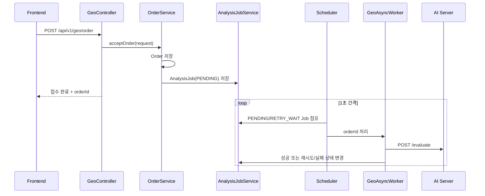
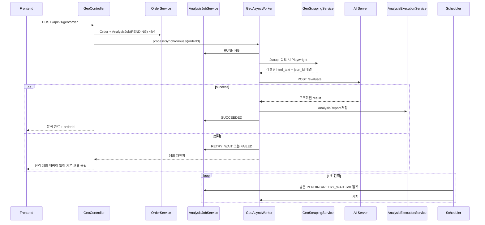

# 중간 계획서 발표 전후 백엔드 시스템 변화

## 1. 결론

중간 계획서 발표 이전의 백엔드는 **주문을 접수하고 `AnalysisJob`을 큐에 넣은 뒤, 스케줄러가 나중에 크롤링과 AI 분석을 수행하는 구조**였다. 기준 커밋 `9e78072`부터 현재 `develop`까지는 다음 방향으로 시스템이 변했다.

1. `Order`에 중복되어 있던 실행 상태를 제거하고, **실행·재시도 상태를 `AnalysisJob`이 전담**하도록 책임을 분리했다.
2. 주문 API가 단순 접수 후 반환하는 방식에서, **같은 HTTP 요청 안에서 크롤링·AI 호출·리포트 저장까지 수행하는 동기 처리 방식**으로 바뀌었다. 기존 스케줄러는 실패 후 재시도 경로로 남아 있다.
3. 리포트 목록·상세·삭제, 계정 프로필·비밀번호 변경·요금제 필드가 추가되어 제품 API 범위가 넓어졌다.
4. Spring → AI 서버 계약이 `meta_tags`를 포함한 단순 텍스트 계약에서, **`url`, `domain`, `html_text`, `json_ld` 네 필드와 구조화된 응답을 사용하는 계약**으로 개편되었다.
5. 고정 fixture와 mock 기반 계약 테스트는 추가됐지만, `FailureStage` 미구현, 스케줄러의 ID 혼용, TECHBLOG 정책 불일치, 삭제 API 소유권 누락 등은 현재도 남아 있다.

따라서 이번 구간은 기능 추가만이 아니라 **주문 중심 모델에서 작업·리포트 중심 모델로 책임을 재배치하고, 실제 AI 서버 계약에 맞추어 데이터 수집·전송·오류 처리를 다시 구성한 시기**로 볼 수 있다. 다만 모든 변경이 운영 완성 상태인 것은 아니다.

## 2. 비교 기준과 조사 범위

| 구분 | Git 기준 | 의미 |
|---|---|---|
| 발표 이전 | `7dc9ba7c10334c1a8bc966afb2547acec75cb401` | 기준 커밋 `9e78072`의 부모. 변화가 시작되기 직전 상태 |
| 변화 시작 | `9e7807290c667716cde3dbf0638f7e1f11243a86` | `modify) add faliurestage and fix false db logic` |
| 발표 이후/현재 | `376e6f43dec5c36face9e2206c14aa2762c56cd6` | 조사 시점 `develop` HEAD |
| 비교 범위 | `7dc9ba7..376e6f4` | 기준 커밋을 포함한 24개 커밋 |
| 조사 날짜 | 2026-09-01 | 현재 로컬 저장소 기준 |

이번 비교는 다음 자료를 사용했다.

- `git log --reverse --first-parent 7dc9ba7..HEAD`
- `git diff --find-renames 7dc9ba7 HEAD`
- 발표 이전 파일은 `git show 7dc9ba7:<path>`로 직접 확인
- 발표 이후는 현재 `develop`의 소스·테스트·설정을 직접 확인
- 미추적 사용자 파일인 `.claude/`는 비교와 문서 작성에서 제외

변경 규모는 전체 48개 파일, 23,101줄 추가, 284줄 삭제이지만, 이 수치에는 `graphify-out/graph.json` 20,444줄과 문서가 포함되어 있다. 실제 운영 코드인 `src/main/java`만 보면 26개 파일에서 669줄 추가, 254줄 삭제이며, 테스트는 11개 파일에서 727줄 추가, 29줄 삭제다.

문서의 판정 용어는 다음과 같다.

| 판정 | 의미 |
|---|---|
| 확인됨 | 현재 코드나 Git diff로 직접 확인한 사실 |
| 테스트 확인 | 이번 조사에서 실제 실행한 테스트가 통과한 사실 |
| 미완성 | 타입·필드·문서만 있고 동작이 연결되지 않은 상태 |
| 불일치 | 코드·테스트·정책 또는 호출자·피호출자의 계약이 서로 다른 상태 |
| 미검증 | 외부 DB·웹사이트·AI 서버 등이 필요해 이번 조사에서 실행하지 않은 항목 |

## 3. 발표 이전과 이후의 핵심 차이

| 영역 | 발표 이전 (`7dc9ba7`) | 발표 이후 (`376e6f4`) | 영향 |
|---|---|---|---|
| 주문 처리 | 주문과 Job 저장 후 즉시 “접수” 응답 | 주문 저장 직후 같은 요청에서 크롤링·AI 분석·리포트 저장까지 수행 | API 응답 시간이 외부 웹사이트와 AI 서버 시간에 직접 의존 |
| 백그라운드 작업 | 스케줄러가 `PENDING`/`RETRY_WAIT` Job을 처리하는 주 경로 | 동기 처리가 주 경로이고 스케줄러는 대기·재시도 Job 처리 경로로 존속 | 동기·스케줄러가 같은 Job을 집을 수 있는 경합 가능성 추가 |
| 실행 상태 | `Order.jobStatus`와 `AnalysisJob.status`가 상태를 중복 보유 | `Order`의 상태 필드 제거, `AnalysisJob.status`만 실행 상태를 보유 | 상태 소유권이 한 곳으로 정리됨 |
| 외부 노출 상태 | 내부 상태명을 그대로 사용 | `PENDING/RUNNING/SUCCEEDED/RETRY_WAIT/FAILED`를 `ACCEPTED/PROCESSING/COMPLETED/FAILED`로 축약 | 프론트 상태 계약이 단순해짐 |
| Order–Job 관계 | `ManyToOne`: 한 Order에 여러 Job 허용 | `OneToOne` + `order_id unique` | 재분석을 새 Job으로 쌓는 구조는 현재 제약과 충돌 |
| 실패 정보 | `errorMessage`, 재시도 횟수 | `lastFailureStage`와 5개 단계 enum 추가 | 단계 값 기록 로직은 TODO라 실제 값은 채워지지 않음 |
| 리포트 목록 | `GET /orders`, Order 중심 응답 | `GET /reports`, Order+Job+Report를 조합 | 진행 중 주문도 상태 중심으로 표시 가능 |
| 리포트 삭제 | 없음 | `DELETED`, `deletedAt`, `POST /report/delete/{orderId}` | soft delete 추가. 소유권 검증은 누락 |
| 계정 | 회원가입·로그인 중심 | 프로필, 비밀번호 변경, `ClientPlan` 추가 | 마이페이지 기반 기능 확장. 요금제 변경 API는 없음 |
| 주문 도메인 | 알 수 없는 값은 `ETC`로 흡수 가능 | `ETC` 제거, 알 수 없는 값은 오류 | 잘못된 도메인을 조기에 거부 |
| AI 요청 | 5필드: `url/domain/html_text/json_ld/meta_tags` | 4필드: `url/domain/html_text/json_ld` | AI 서버 현재 입력 계약에 맞춤 |
| AI 응답 | `status/result_type/content` | `status/domain/result/reason/detail` 및 품질 부가 필드 | 성공 결과와 오류 원인을 구조적으로 처리 |
| 본문 추출 | DOM 전체 텍스트를 평탄화하고 3,500자로 자름 | `article → main → body`를 Markdown으로 변환하고 라벨 섹션으로 조립 | 제목·목록·표·코드 같은 구조 보존 향상 |
| JSON-LD | 여러 script 원문을 문자열로 합친 뒤 한 번에 파싱 | script별 독립 파싱, 잘못된 script만 제외, 항상 배열 | 일부 JSON-LD 오류가 전체 입력을 깨뜨리지 않음 |
| 실행 설정 | `spring.application.name`만 존재 | DB/JPA/OAuth/JWT/스크래핑/AI 설정을 환경변수 기반으로 구성 | 실행 환경 명시성이 높아졌으나 스키마는 `ddl-auto: update`에 의존 |
| 검증 | 제한적인 단위·통합 테스트 | AI 요청·응답·스크래핑 계약 fixture와 live test 추가 | 자동 검증 범위 확대. live test 격리는 미완성 |

## 4. 요청 처리 흐름 변화

### 4.1 발표 이전



발표 이전의 `POST /order`는 분석 결과를 기다리지 않았다. `Order`와 `AnalysisJob`만 만든 뒤 “GEO 분석 요청이 접수되었습니다.”를 반환했고, 실제 처리는 `@Scheduled` 작업이 담당했다.

### 4.2 발표 이후 현재



현재 핵심 호출 근거는 다음과 같다.

- [`GeoController`](../src/main/java/com/malgeum/geo/GeoController.java#L49-L54)가 `acceptOrder` 직후 `processSynchronously`를 호출한다.
- [`GeoAsyncWorker`](../src/main/java/com/malgeum/geo/service/GeoAsyncWorker.java#L67-L79)는 같은 요청 스레드에서 상태 변경, 크롤링, AI 호출, 결과 저장을 수행한다.
- 같은 클래스의 `@Scheduled` 루프도 제거되지 않고 남아 있다.

이 변화는 이름이 `GeoAsyncWorker`라는 사실과 무관하게, **정상 주문 API 경로를 실질적으로 동기 처리로 바꾼 변경**이다.

## 5. 영역별 상세 변화

### 5.1 주문·작업 상태와 DB 모델

#### 상태 책임 분리

발표 이전에는 `Order.jobStatus`와 `AnalysisJob.status`가 모두 `PENDING`, `RUNNING`, 성공, 재시도, 실패를 표현했다. 이 구조에서는 두 엔티티의 값이 서로 달라질 수 있었다.

현재는 [`Order`](../src/main/java/com/malgeum/geo/domain/domain/order/entity/Order.java)에 실행 상태가 없고, [`AnalysisJob`](../src/main/java/com/malgeum/geo/domain/domain/analysisjob/entity/AnalysisJob.java#L35-L55)이 다음 실행 상태를 전담한다.

```text
PENDING -> RUNNING -> SUCCEEDED
                    -> RETRY_WAIT -> RUNNING
                    -> FAILED
```

프론트에는 [`AnalysisJobStatus.toExternal()`](../src/main/java/com/malgeum/geo/domain/domain/analysisjob/entity/AnalysisJobStatus.java#L10-L22)을 통해 다음처럼 축약해서 노출한다.

| 내부 상태 | 외부 상태 |
|---|---|
| `PENDING` | `ACCEPTED` |
| `RUNNING` | `PROCESSING` |
| `RETRY_WAIT` | `PROCESSING` |
| `SUCCEEDED` | `COMPLETED` |
| `FAILED` | `FAILED` |

#### 1:1 관계 강화

기준 커밋 `9e78072`에서 `AnalysisJob.order`는 `ManyToOne`에서 `OneToOne`으로 바뀌고 `analysis_job.order_id`에 unique 제약이 선언됐다. 한 주문당 한 작업이라는 현재 정책은 명확해졌지만, 같은 주문의 재분석 이력을 여러 Job으로 남기는 방향과는 양립하지 않는다.

#### FailureStage는 아직 미완성

기준 커밋 이름은 `add faliurestage`이지만, 현재 구현 상태는 다음과 같다.

- `lastFailureStage` 컬럼과 `ORDER_LOADING`, `SCRAPING`, `AI_REQUEST`, `AI_RESPONSE_PARSING`, `REPORT_SAVING` enum은 존재한다.
- `markFailed()`에서 값을 설정하는 코드는 주석 처리된 TODO다.
- `checkFailureStage()`도 항상 `REPORT_SAVING`을 반환하는 임시 코드이며 호출되지 않는다.

따라서 **DB 필드 추가는 확인됐지만 실패 단계 추적 기능이 완성됐다고 볼 수 없다.** 현재 실패 원인은 `errorMessage`에만 실질적으로 남는다.

#### 스키마 변경 방식

이번 구간에는 SQL/Flyway/Liquibase 마이그레이션이 없다. 현재 설정은 `spring.jpa.hibernate.ddl-auto: update`이므로 다음 변경이 명시적 마이그레이션 없이 Hibernate 자동 갱신에 의존한다.

- `analysis_job.order_id` unique 제약
- `analysis_job.last_failure_stage`
- `analysis_report.deleted_at`
- `client.plan`
- 코드에서 제거된 `client_order` 실행 상태 컬럼

특히 기존에 한 주문에 여러 Job이 있으면 unique 제약 추가가 실패할 수 있고, 제거된 컬럼은 `ddl-auto: update`가 정리하지 않을 수 있다. 실제 운영 DB의 적용 결과는 이번 조사에서 확인하지 못했다.

### 5.2 리포트 API와 책임 이동

#### API 변화

| Method | 발표 이전 | 발표 이후 |
|---|---|---|
| `GET /api/v1/geo/orders` | 존재, Order 목록 반환 | 제거됨 |
| `GET /api/v1/geo/reports` | 없음 | 추가, Order·Job·Report 조합 목록 반환 |
| `POST /api/v1/geo/order` | 접수 후 즉시 반환 | 동기 분석 완료 후 반환 |
| `GET /api/v1/geo/report/{orderId}` | 완료된 리포트가 없으면 오류 | Job 상태·오류 메시지를 포함해 진행 중에도 응답 가능 |
| `POST /api/v1/geo/report/delete/{orderId}` | 없음 | soft delete 후 204 반환 |

`GET /orders`가 `GET /reports`로 대체된 것은 프론트엔드 계약 관점에서 breaking change다. `POST /order`의 응답 메시지도 “접수되었습니다”에서 “분석이 완료되었습니다”로 바뀌었고, 응답 시점 자체가 달라졌다.

#### 리포트 soft delete

[`AnalysisReport`](../src/main/java/com/malgeum/geo/domain/domain/analysisreport/entity/AnalysisReport.java#L52-L87)에 `DELETED` 상태와 `deletedAt`이 추가됐다. 목록 조회는 삭제된 리포트를 제외하며, 아직 리포트가 없는 주문도 Job 상태를 표시할 수 있다. `AnalysisJob`이 없는 레거시 주문은 로그를 남기고 목록에서 제외한다.

#### 확인된 보안 공백

상세 조회는 로그인 사용자와 `order.client.id`를 비교하지만, [`deleteReport`](../src/main/java/com/malgeum/geo/domain/domain/analysisreport/service/AnalysisReportService.java#L88-L93)는 리포트 존재 여부만 확인하고 소유권을 검사하지 않는다. URL 보안 규칙상 인증은 필요하지만, 인증된 사용자가 다른 고객의 `orderId`를 알면 삭제 상태로 바꿀 수 있다. 새로 추가된 삭제 기능은 소유권 검증이 보완되어야 한다.

### 5.3 계정·프로필·요금제

다음 기능이 새로 추가됐다.

- `GET /api/v1/geo/profile`: 이메일, 이름, 전화번호, 회사, 요금제 반환
- `POST /api/v1/geo/change_password`: 기존 비밀번호 확인, 새 비밀번호 8~64자 및 확인값 검증
- `Client.plan`: `FREE`, `BASIC`, `PRO`, `ENTERPRISE`
- 일반 가입과 OAuth 신규 계정의 기본 플랜: `FREE`

단, `Client`의 `updatePlan*()` 메서드는 호출하는 서비스나 API가 없다. 따라서 **플랜 저장·프로필 노출은 구현됐지만, 구독 변경·결제·사용량 제한은 구현되지 않았다.**

### 5.4 주문 도메인 처리

발표 이전에는 `serviceType`이 비어 있거나 분류되지 않으면 `DomainStatus.ETC`로 저장할 수 있었다. 현재는 `ETC`가 제거됐고, 알 수 없는 값은 `DataNotFoundException`으로 거부한다.

현재 지원 관계는 다음과 같다.

| 단계 | 허용 도메인 |
|---|---|
| 주문 DTO 분류 | `NEWS`, `ECOMMERCE`, `EDUCATION`, `TECHBLOG` |
| AI 요청 생성 | `news`, `ecommerce`, `education`만 허용 |

이 때문에 `SaaS`, `테크`, `기술` 키워드는 주문 단계에서 `TECHBLOG`로 정상 변환되지만, 크롤링 후 [`GeoEvaluationRequest.from()`](../src/main/java/com/malgeum/geo/dto/GeoEvaluationRequest.java#L18-L32)에서 거부된다. 테스트는 주문 단계에서 TECHBLOG를 거부해야 한다고 기대하므로 현재 코드와 테스트가 불일치한다.

### 5.5 스크래핑과 AI 요청 계약

#### 요청 JSON 변화

발표 이전:

```json
{
  "url": "...",
  "domain": "...",
  "html_text": "평탄화되고 최대 3500자로 잘린 텍스트",
  "json_ld": null,
  "meta_tags": {}
}
```

발표 이후:

```json
{
  "url": "...",
  "domain": "news|ecommerce|education",
  "html_text": "[DOCUMENT_TYPE] ... [MAIN_CONTENT] ...",
  "json_ld": []
}
```

현재 [`GeoEvaluationRequest`](../src/main/java/com/malgeum/geo/dto/GeoEvaluationRequest.java)는 정확히 네 필드만 직렬화한다. `meta_tags`는 제거됐고, JSON-LD가 없으면 `null`이 아니라 빈 배열을 사용한다. 3,500자 강제 절단도 제거됐다.

#### 본문 추출 변화

발표 이전에는 Jsoup DOM에서 header/nav/footer 등을 제거한 뒤 `doc.body().text()`로 모든 구조를 평탄화했다. 현재 [`GeoScrapingService`](../src/main/java/com/malgeum/geo/service/GeoScrapingService.java)는 다음 순서를 사용한다.

1. Jsoup으로 정적 HTML 수집
2. `article`, `main`, `body` 순서로 본문 root 선택
3. Flexmark로 HTML을 Markdown으로 변환
4. 본문이 50자 미만이거나 전체가 `Loading...` 같은 shell placeholder이면 Playwright로 재렌더링
5. JSON-LD `@type`을 우선 사용해 문서 유형 분류
6. 다음 순서의 비어 있지 않은 섹션을 `\n\n`으로 조립

```text
[DOCUMENT_TYPE]
[TITLE]
[AUTHOR]
[PUBLISHED]
[PUBLISHER]
[MAIN_CONTENT]
```

이 변경으로 제목, 문단, 목록, 표, 코드 블록의 구조를 AI 입력에 더 많이 보존할 수 있게 됐다.

#### JSON-LD 변화

발표 이전에는 모든 `application/ld+json` script의 문자열을 합친 후 한 번에 파싱했다. 하나의 script가 잘못되면 전체 결과가 `null`이 될 수 있었다.

현재는 script별로 독립 파싱한다. 객체는 그대로 배열에 넣고, 배열 안에서는 객체만 펼쳐 넣으며, 깨진 script만 건너뛴다. 결과가 없더라도 빈 배열을 반환한다. 이 동작은 고정 fixture 테스트로 확인했다.

### 5.6 AI 응답과 오류 처리

발표 이전 응답 DTO는 다음 세 필드였다.

```text
status, result_type, content
```

현재 응답 DTO는 다음 구조를 수용한다.

```text
status, domain, result, reason, detail,
content_warning, main_content_length, cjk_normalized, jsonld_input
```

주요 처리 변화는 다음과 같다.

- HTTP 429 → `rate-limited`
- HTTP 422 → `invalid-input`
- HTTP 400 → `bad-request`
- HTTP 5xx → `server-error`
- 연결/읽기 실패 → `timeout`
- FastAPI 오류 응답의 `detail`을 파싱해 보존
- `success`일 때 `result`와 품질 부가 필드를 `rawAILog`에 저장
- `insufficient_content`, `parse_error`, 그 밖의 오류를 다른 메시지로 분기
- AI read timeout을 60초에서 200초로 확대

다만 모든 실패가 현재 동일한 `markFailureOrRetry()`로 들어가므로, 400/422처럼 재시도해도 해결되지 않는 입력 오류와 429/5xx처럼 재시도 가능한 오류를 재시도 정책에서 구분하지는 않는다.

### 5.7 설정·문서·검증 자산

- `application.yaml`이 애플리케이션 이름 한 줄에서 DB/JPA/OAuth/JWT/스크래핑/AI 서버 설정으로 확장됐다.
- DB 비밀번호, OAuth client secret, JWT secret, AI base URL 등 민감 설정은 현재 환경변수 참조로 작성되어 있다.
- `.env` import, forwarded header·문자 인코딩 관련 실행 설정이 명시됐다.
- AI 입력 계약 계획서와 백엔드 구현 흐름 문서가 `docs/`에 추가됐다.
- 코드 그래프 산출물 `graphify-out/`이 추가됐지만 런타임 동작에는 참여하지 않는다.
- 테스트 표준 출력을 항상 보이게 하는 Gradle 설정이 추가됐다.
- 실제 웹사이트와 실제 AI 서버를 호출하는 `GeoAiServerLiveTest`가 추가됐으며, 이 테스트에는 AI 서버 주소가 별도로 하드코딩되어 있다.

`GeoAiServerLiveTest`는 주석상 수동 테스트지만 `@Disabled`나 별도 Gradle source set이 없다. 따라서 현재 전체 `test` 실행에 자동 포함되어 외부 네트워크와 AI 서버 상태에 따라 실패하거나 의도치 않은 실제 호출을 만들 수 있다.

## 6. 커밋 흐름

| 날짜 | 커밋 | 변화 요약 |
|---|---|---|
| 07-14 | `9e78072` | Order–Job을 1:1로 변경, `lastFailureStage` 필드와 enum 추가 |
| 07-14 | `e738f6e` | 주문 후 동기 분석 추가, Order/Job 상태 책임 분리 시작 |
| 07-14 | `1ed5f7e` | Worker의 직접 repository 접근을 service로 이동 |
| 07-16 | `a01cfd9` | `AnalysisJobService.getAnalysisJob()` 추가 |
| 07-16 | `542fb55` | `.gitignore` 보완 |
| 07-26 | `3fa5598` | 비밀번호 변경 DTO·서비스·API 추가 |
| 07-27 | `ff64b4b` | 계정 프로필 조회 DTO·서비스·API 추가 |
| 07-27 | `965cdf6` | Order DTO를 도메인 패키지로 이동, `ETC` 제거 |
| 07-28 | `32ad71d` | 리포트 `DELETED` 상태와 삭제 시각·서비스 추가 |
| 08-01 | `302d62e` | 리포트 삭제 API 추가 |
| 08-01 | `b06249e` | Client 요금제 필드·enum·프로필 노출 추가 |
| 08-01 | `828403f` | Flexmark HTML→Markdown 변환 도입 |
| 08-01 | `dad451d` | `ScrapedData` 인자 순서와 호출부 정리 |
| 08-04 | `e374eec` | `/orders`를 `/reports`로 변경, 목록 책임을 ReportService로 이동 |
| 08-05 | `6b0a74a` | 리포트 목록 repository 반환형을 `List`로 수정 |
| 08-05 | `2028cc9` | Order 상태 완전 제거, Job 외부 상태 매핑과 진행 중 상세 조회 추가 |
| 08-08 | `13c9fc1` | AI 요청을 4필드로 변경, 구조화 응답 DTO와 200초 timeout 도입 |
| 08-23 | `068fc2e` | AI 입력 계약 구현 계획서 추가 |
| 08-23 | `40073cc` | `.gitignore` 수정 |
| 08-24 | `5926de5` | 라벨형 본문, JSON-LD 독립 파싱, fixture 계약 테스트 구현 |
| 08-24 | `485dd9f` | AI 오류 분류, 응답 부가 필드, 도메인 검증, Worker 분기 테스트 추가 |
| 08-28 | `ac6c7e0` | 문서를 `docs/`로 정리하고 구현 흐름 문서 추가 |
| 08-29 | `65e97ab` | 환경변수 기반 실행 설정과 코드 그래프 산출물 추가 |
| 08-29 | `376e6f4` | 실제 AI 서버 live test와 테스트 표준 출력 설정 추가 |

## 7. 이번 조사에서 실행한 검증

### 통과

다음 명령으로 외부 AI 서버와 실제 웹사이트를 사용하지 않는 대상 테스트를 실행했다.

```powershell
.\gradlew.bat test --no-daemon `
  --tests com.malgeum.geo.service.GeoScrapingServiceContractTest `
  --tests com.malgeum.geo.dto.GeoEvaluationRequestTest `
  --tests com.malgeum.geo.service.GeoAIServiceTest `
  --tests com.malgeum.geo.service.GeoAsyncWorkerResponseHandlingTest
```

결과: **20개 테스트 통과, 실패 0개**

| 테스트 | 개수 | 결과 |
|---|---:|---|
| `GeoScrapingServiceContractTest` | 6 | 통과 |
| `GeoEvaluationRequestTest` | 3 | 통과 |
| `GeoAIServiceTest` | 6 | 통과 |
| `GeoAsyncWorkerResponseHandlingTest` | 5 | 통과 |

이 실행에서 `compileJava`와 `compileTestJava`도 성공했다.

### 실패 재현

```powershell
.\gradlew.bat test --no-daemon `
  --tests com.malgeum.geo.domain.domain.order.dto.GeoOrderRequestTest
```

결과: **3개 중 2개 통과, 1개 실패**

- 실패 테스트: `resolvedDomainStatus_RejectsTechBlogKeywords`
- 원인: 테스트는 TECHBLOG 키워드를 주문 단계에서 거부한다고 기대하지만, 현재 코드는 `DomainStatus.TECHBLOG`로 반환한다.

### 실행하지 않은 검증

- 전체 테스트 스위트
- 실제 PostgreSQL 스키마 반영
- 실제 웹사이트 크롤링
- 실제 AI 서버 `/evaluate` 호출
- Playwright가 필요한 동적 페이지 테스트

전체 테스트를 실행하지 않은 이유는 현재 `GeoAiServerLiveTest`가 격리되지 않아 실제 외부 서버를 호출하기 때문이다. 따라서 이 문서의 검증 결과를 전체 시스템 통합 성공으로 해석하면 안 된다.

## 8. 남은 문제와 우선순위

| 우선순위 | 문제 | 근거와 영향 |
|---|---|---|
| 높음 | 리포트 삭제 소유권 검증 없음 | 인증된 사용자가 다른 고객의 `orderId`로 soft delete 가능 |
| 높음 | 스케줄러 경로의 `jobId`/`orderId` 혼용 | `markSucceeded()`와 `markFailureOrRetry()`는 orderId를 기대하지만 Worker는 jobId 전달 |
| 높음 | 동기 처리와 스케줄러의 중복 처리 가능성 | 주문 커밋 후 동기 처리 시작 전 스케줄러가 같은 PENDING Job을 점유할 수 있음 |
| 중간 | TECHBLOG 정책·테스트 불일치 | 주문·크롤링 후 AI 요청 직전에 실패하며 불필요한 재시도 발생 |
| 중간 | `FailureStage` 미구현 | 필드와 enum은 있으나 실제 실패 단계가 저장되지 않음 |
| 중간 | 비재시도 오류 구분 없음 | 400/422 입력 오류도 429/5xx와 같은 재시도 경로 사용 |
| 중간 | DB migration 부재 | unique 제약·신규 컬럼 적용을 `ddl-auto: update`에 의존 |
| 중간 | live test 자동 포함 | 전체 테스트가 네트워크·실제 AI 서버 상태에 의존 |
| 낮음 | 요금제 변경 흐름 없음 | plan 필드는 보이지만 결제·변경·제한 정책이 연결되지 않음 |

### 스케줄러 ID 불일치 상세

현재 [`AnalysisJobService.markSucceeded(Long)`](../src/main/java/com/malgeum/geo/domain/domain/analysisjob/service/AnalysisJobService.java#L51-L56)와 `markFailureOrRetry(Long, Exception)`은 인자를 `orderId`로 사용해 `findByOrderId()`를 호출한다. 그러나 [`GeoAsyncWorker.processNextJob()`](../src/main/java/com/malgeum/geo/service/GeoAsyncWorker.java#L50-L63)은 다음처럼 `jobId`를 전달한다.

```java
analysisJobService.markSucceeded(jobId);
analysisJobService.markFailureOrRetry(jobId, e);
```

`AnalysisJob.id`와 `Order.id`가 우연히 같을 때는 드러나지 않지만, 값이 달라지면 다른 주문의 Job을 갱신하거나 `DataNotFoundException`이 발생할 수 있다. 동기 경로는 `orderId`를 전달하므로 이 문제는 스케줄러 경로에 집중되어 있다.

## 9. 최종 판단

발표 이후 백엔드는 다음 수준까지 발전했다.

- 도메인 책임: `Order`는 요청 데이터, `AnalysisJob`은 실행 상태, `AnalysisReport`는 결과물 수명주기를 담당
- 처리 파이프라인: 주문 → 크롤링 → AI 요청 → 결과 저장을 한 흐름으로 연결
- AI 계약: 실제 서버 형식에 가까운 4필드 입력과 구조화 응답으로 정리
- 제품 기능: 리포트 관리와 계정 프로필 기능 추가
- 검증: 핵심 AI 계약에 대한 고정 fixture·mock 테스트 추가

반면 운영 준비도 관점에서는 **상태 모델의 방향은 정리됐지만 동시성·권한·재시도 정책·DB migration·live test 격리가 남아 있다.** 특히 기준 커밋의 핵심 명칭인 `FailureStage`는 현재도 실동작하지 않으므로, “발표 이후 실패 단계 추적이 완성됐다”고 설명해서는 안 된다.
